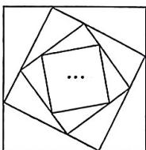

<!-- question-source:start -->
8.[辽宁大连2024高二月考]侏罗纪蜘蛛网是一种非常有规律的蜘蛛网,如图,蜘蛛网是由无数个正方形环绕而成的,且每一个正方

形的四个顶点都恰好在它的外边最近一个正方形四条边的三等分点上,设外围第1个正方形的周长是m,第n个正方形的周长为 $a_{n}$ ,侏罗纪蜘蛛网的长度(蜘蛛网中正方形的周长之和)为 $S_{n}$ ,则下面选项中正确的是()
A. $S_{2}=\frac{\sqrt{5}}{3}m$ B. $S_{3}=\frac{5}{9}m$ C. $a_{2}=\frac{2}{3}m$ D. $a_{3}=\frac{5}{9}m$

## 刷易错

## 易错点1 错认项数求和而致错
<!-- question-source:end -->

![[Q00070175A1]]
