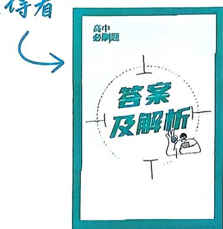

<!-- source-part:1 pages:1-50 -->

## 高中 2026 总主编：杨文彬 主编：赵成海 必刷题®

## 含新定义、开放题等

配
狂K重点

NEW

电子预习卡

视频微课轻松看

数学

选择性必修 第二册 RJA

# 高中 必刷题

总主编：杨文彬

主 编：赵成海

编者：甘建军 王雪峰 钱宇 王欢 黄志军 李树堂
谭彩绒 杜风霞 王金贵 安博 韩磊 刘卫东
余强 郭贵生 李阳 苗翠茹 桑永利 张妮

万昕君 吴巧梅 于传洪

审订：林国炜 唐永明 李永强 袁媛 陈友全 杨国伟

刷题人：

数学

选择性必修 第二册 RJA

## CONTENTS 目录

4.1 数列的概念 …… 副基础 功能 (1) (91)
4.2 等差数列 …… (4) (93)
4.2.1 等差数列的概念 …… 副基础 提升 (4) (93)
4.2.2 等差数列的前 n 项和公式 …… (8) (95)
课时 1 等差数列的前 n 项和(1) …… 副基础 (8) (95)
课时 2 等差数列的前 n 项和(2) …… 副基础 提升 (10) (97)
第 4.2 节综合训练 …… 功能 (13) (99)
4.3 等比数列 …… (15) (100)
4.3.1 等比数列的概念 …… 副基础 提升 (15) (100)
4.3.2 等比数列的前 n 项和公式 …… (19) (103)
课时 1 等比数列的前 n 项和(1) …… 副基础 (19) (103)
课时 2 等比数列的前 n 项和(2) …… 副基础 提升 (20) (104)
第 4.3 节综合训练 …… 功能 (23) (106)
专题 1 通项公式的求法 …… 劉难关 (25) (108)
专题 2 数列求和 …… 劉难关 (26) (109)
专题 3 数列的综合应用 …… 劉难关 (28) (111)
专题 4 数列放缩求和 …… 劉难关 (30) (113)
4.4” 数学归纳法 …… 劉基础 (31) (115)
第四章素养检测 …… 劉速度 (32) (115)
第四章高考强化 …… 劉真题 劉原创 (35) (117)

5.1 导数的概念及其意义 …… (39) (121)
5.1.1 变化率问题 …… 劉基础 (39) (121)
5.1.2 导数的概念及其几何意义 …… (40) (121)
课时 1 导数的概念 …… 劉基础 (40) (121)
课时 2 导数的几何意义 …… 劉基础 (41) (122)
第 5.1 节综合训练 …… 劉能力 (42) (123)
5.2 导数的运算 …… (43) (123)
5.2.1 基本初等函数的导数…… 劉基础 (43) (123)
5.2.2 导数的四则运算法则…… 劉基础 提升 (44) (124)
5.2.3 简单复合函数的导数…… 劉基础 (46) (125)
第 5.2 节综合训练 …… 劉能力 (47) (126)

## CONTENTS 目录

5.3 导数在研究函数中的应用 …… (48) (127)
5.3.1 函数的单调性 …… 基础 提升 (48) (127)
5.3.2 函数的极值与最大(小)值 …… (51) (130)
课时 1 函数的极值 …… 基础 提升 (51) (130)
课时 2 函数的最大(小)值 …… 基础 提升 (54) (133)
第 5.3 节综合训练 …… 能力 (59) (138)
专题 5 含参函数单调性的分类讨论 …… 难关 (60) (140)
专题 6 利用导数证明不等式 …… 难关 (61) (141)
专题 7 导数与零点的综合 …… 难关 (64) (144)
专题 8 曲线的公切线问题 …… 难关 (66) (147)
专题 9 三次函数的图象与性质 …… 难关 (68) (150)
专题 10 导数中的隐零点问题 …… 难关 (69) (152)
专题 11 构造法在导数中的应用 …… 难关 (70) (153)
专题 12 导数中的指对同构问题 …… 难关 (72) (155)
专题 13 导数中的双变量问题 …… 难关 (74) (159)
专题 14 极值点偏移问题 …… 难关 (76) (162)
第五章素养检测 …… 到速度 (78) (165)
第五章高考强化 …… 真题 到原创 (82) (168)

…… 素养 (86) (173)
…… 素养 (87) (175)
…… 综合 (88) (175)

高考新题型

找深度解析还得看

## 易错警示

易错警示
22个『易错警示』，将小细节一网打尽，快收下这份360°避坑指南！
• 多种解法
45个『多种解法』，拒绝僵化，灵活领先，多种思路，多种可能。
• 链接教材
回归教材，16个『链接教材』，助你夯实基础，以不变应万变！
• 思路导引
不再纠结于繁杂过程，16个『思路导引』直击破题点和隐含条件，助你一路绿灯。
• 规律方法
天才解题可不是靠乱猜的！ 32个『规律方法』帮你找规律，有捷径才能事半功倍。
• 名师点拨
老师点一点，玄机自然显。 28个『名师点拨』，老师的独家秘笈都属于你！

拓展4 利用导数求函数的极值与最值 P56
拓展3 已知单调性求参数的取值范围 P55
拓展5 根据函数的极值或最值求参数 P57

## 重难专题

专题1 通项公式的求法 …… 25
题型1 累加法 题型2 累乘法
题型3 利用 $a_{n}$ 与 $S_{n}$ 的关系 题型4 构造法

专题2 数列求和 …… 26
题型1 公式法求和 题型2 倒序相加法求和
题型3 并项求和法 题型4 分组求和法
题型5 裂项相消法求和 题型6 错位相减法求和
题型7 转化法求和 题型8 分段求和

专题3 数列的综合应用 …… 28
题型1 数列的应用
题型2 数列与函数、不等式的综合
题型3 等差数列、等比数列的综合问题

专题4 数列放缩求和 …… 30
专题5 含参函数单调性的分类讨论 …… 60
题型1 导函数能因式分解 题型2 导函数不能因式分解

专题6 利用导数证明不等式 …… 61
题型1 单元不等式 题型2 多元不等式
题型3 求和（积）不等式

专题7 导数与零点的综合 …… 64
题型1 判断零点个数 题型2 根据零点个数求参数
题型3 研究零点关系

专题8 曲线的公切线问题 …… 66
题型1 求曲线的公切线或公切线条数
题型2 已知公切线或公切线条数求参数值（范围）
题型3 研究公切线性质

专题9 三次函数的图象与性质 …… 68
题型1 三次函数的单调性、极值、最值、零点
题型2 三次函数图象的切线、对称中心（拐点）

专题10 导数中的隐零点问题 …… 69
题型1 与隐零点有关的不等式问题
题型2 与隐零点有关的零点问题

专题11 构造法在导数中的应用 …… 70
题型1 根据形式构造函数利用导数研究不等关系
题型2 根据主元构造函数利用导数研究不等关系

## 重难就要刷又刷

拓展1 数列通项公式的基本求法 P3
拓展4 通项 $a_{n}$ 与其前 $n$ 项和 $S_{n}$ 的关系 P6
单元高难问题1 由递推公式推导通项公式 P32
拓展1 等差数列的求和策略 P15
拓展1 等比数列前 $n$ 项和的求和策略 P28
单元高难问题2 数列求和 P35
突破 等差数列与等比数列的交汇问题 P31

拓展2 利用导数研究函数的单调性 P54
突破1 利用导数证明不等式 P59
突破3 利用导数解决“恒成立”问题与“能成立”问题 P63
突破2 利用导数研究函数的零点、方程的根 P60
突破利用导数的几何意义求解有关的公切线问题 P46

难点1 构造函数解决不等式问题 P64

## 12 导数中的指对同构问题

题型1 同构变形

题型2 利用同构思想求值

题型3 利用同构思想求最值 题型4 利用同构思想研究不等式

题型5 利用同构思想研究零点

## 13 导数中的双变量问题

题型1 函数单调性的双变量等价形式

题型2 关联双变量，消元研究 题型3 关联双变量，独立研究

题型4 独立双变量，分离研究 题型5 独立双变量，分步研究

## 14 极值点偏移问题

题型1 和、积、平方和、倒数和的偏移

题型2 指数、对数形式的偏移

题型3 特定条件下的偏移 题型4 不对称形式的偏移难点4 导数中的指对同构问题 P70

难点3 利用导数解决双变量问题 P67

难点2 利用导数解决极值点偏移问题 P65

◎○○

## 素养凝练

助你拓宽新思路

## 高考新动向·新定义、新情境

<table><tr><td>斐波那契数列与递推公式</td><td>P3第7题</td><td>古代建筑中的举架结构与等差数列</td><td>P35第7题</td></tr><tr><td>“中国剩余定理”与等差数列通项</td><td>P5第19题</td><td>汉代标准量器的容积与等比数列</td><td>P36第15题</td></tr><tr><td>会徽图案与等差数列</td><td>P6第9题</td><td>剪纸图形与数列</td><td>P36第18题</td></tr><tr><td>“三角垛”各层球数与数列求和</td><td>P11第5题</td><td>类比求导</td><td>P46第8题</td></tr><tr><td>侏罗纪蜘蛛网与等比数列</td><td>P20第8题</td><td>“凸函数”与导函数的关系</td><td>P47第5题</td></tr><tr><td>月相与等比数列求和</td><td>P21第5题</td><td>“隔离直线”的理解与导数的几何意义</td><td>P47第8题</td></tr><tr><td>递推解决五猴分桃问题</td><td>P23第4题</td><td>“双重切线”的判定与导数的几何意义</td><td>P67第11题</td></tr></table>

## 高考新动向·链接高数

<table><tr><td>正方形数、五边形数与数列递推</td><td>P3 第 4 题</td><td>“拉格朗日中值点”的判定</td><td>P45 第 4 题</td></tr><tr><td>“冰雹猜想”与数列递推</td><td>P17 第 10 题</td><td>牛顿迭代法求方程解的理解与应用</td><td>P61 第 3 题</td></tr><tr><td>“康托三分集”的理解与应用</td><td>P28 第 3 题</td><td>曲线“拐点”的理解与应用</td><td>P68 第 6 题</td></tr><tr><td>“四分差数列”的理解与应用</td><td>P34 第 19 题</td><td>“洛必达法则”求极限</td><td>P78 第 3 题</td></tr><tr><td>(i-j)-可分数列的理解、判定与应用</td><td>P37 第 21 题</td><td>泰勒展开式的理解与应用</td><td>P86 第 5 题</td></tr></table>

## 强基计划

<table><tr><td>【福建厦门大学2023强基计划】数列递推公式的理解与数列求和</td><td>P3第9题</td></tr><tr><td>【北京大学2024强基计划】数列通项的理解与推导</td><td>P14第14题</td></tr><tr><td>【东南大学2025强基计划】数列递推求和</td><td>P18第17题</td></tr><tr><td>【清华大学2024强基计划】数列递推公式的理解与等比数列的构造</td><td>P24第12题</td></tr><tr><td>【中国科学技术大学2023强基计划】等差数列与等比数列的综合</td><td>P24第13题</td></tr><tr><td>【南京大学2022强基计划】根据函数图象交点个数与导数求参数范围</td><td>P47第9题</td></tr><tr><td>【武汉大学2022强基计划】根据函数在区间上的单调性求参数范围</td><td>P50第9题</td></tr><tr><td>【北京大学2023强基计划】判断方程根的个数</td><td>P50第10题</td></tr><tr><td>【上海交通大学2024强基计划】根据三次函数导数值的范围求参数范围</td><td>P58第13题</td></tr><tr><td>【清华大学2023强基计划】根据三次方程解的个数求参数范围</td><td>P58第14题</td></tr><tr><td>【北京大学2025强基计划】根据三次方程根满足的条件求参数范围</td><td>P58第15题</td></tr></table>

![[高中/课堂同步/教辅/必刷题/2026版 必刷题 数学选择性必修第二册RJA/01_第一章/4_1_数列的概念/4_1_数列的概念.md]]
![[高中/课堂同步/教辅/必刷题/2026版 必刷题 数学选择性必修第二册RJA/01_第一章/4_2_等差数列/4_2_等差数列.md]]
![[高中/课堂同步/教辅/必刷题/2026版 必刷题 数学选择性必修第二册RJA/01_第一章/4_2_1_等差数列的概念/4_2_1_等差数列的概念.md]]
![[高中/课堂同步/教辅/必刷题/2026版 必刷题 数学选择性必修第二册RJA/01_第一章/4_2_2_等差数列的前_n_项和公式/4_2_2_等差数列的前_n_项和公式.md]]
![[高中/课堂同步/教辅/必刷题/2026版 必刷题 数学选择性必修第二册RJA/01_第一章/课时_1_等差数列的前_n_项和_1_/课时_1_等差数列的前_n_项和_1_.md]]
![[高中/课堂同步/教辅/必刷题/2026版 必刷题 数学选择性必修第二册RJA/01_第一章/课时_2_等差数列的前_n_项和_2_/课时_2_等差数列的前_n_项和_2_.md]]
![[高中/课堂同步/教辅/必刷题/2026版 必刷题 数学选择性必修第二册RJA/01_第一章/第_4_2_节综合训练/第_4_2_节综合训练.md]]
![[高中/课堂同步/教辅/必刷题/2026版 必刷题 数学选择性必修第二册RJA/01_第一章/4_3_等比数列/4_3_等比数列.md]]
![[高中/课堂同步/教辅/必刷题/2026版 必刷题 数学选择性必修第二册RJA/01_第一章/4_3_1_等比数列的概念/4_3_1_等比数列的概念.md]]
![[高中/课堂同步/教辅/必刷题/2026版 必刷题 数学选择性必修第二册RJA/01_第一章/4_3_2_等比数列的前_n_项和公式/4_3_2_等比数列的前_n_项和公式.md]]
![[高中/课堂同步/教辅/必刷题/2026版 必刷题 数学选择性必修第二册RJA/01_第一章/课时_1_等比数列的前_n_项和_1_/课时_1_等比数列的前_n_项和_1_.md]]
![[高中/课堂同步/教辅/必刷题/2026版 必刷题 数学选择性必修第二册RJA/01_第一章/课时_2_等比数列的前_n_项和_2_/课时_2_等比数列的前_n_项和_2_.md]]
![[高中/课堂同步/教辅/必刷题/2026版 必刷题 数学选择性必修第二册RJA/01_第一章/第_4_3_节综合训练/第_4_3_节综合训练.md]]
![[高中/课堂同步/教辅/必刷题/2026版 必刷题 数学选择性必修第二册RJA/01_第一章/专题_1_通项公式的求法/专题_1_通项公式的求法.md]]
![[高中/课堂同步/教辅/必刷题/2026版 必刷题 数学选择性必修第二册RJA/01_第一章/专题_2_数列求和/专题_2_数列求和.md]]
![[高中/课堂同步/教辅/必刷题/2026版 必刷题 数学选择性必修第二册RJA/01_第一章/专题_3_数列的综合应用/专题_3_数列的综合应用.md]]
![[高中/课堂同步/教辅/必刷题/2026版 必刷题 数学选择性必修第二册RJA/01_第一章/专题_4_数列放缩求和/专题_4_数列放缩求和.md]]
![[高中/课堂同步/教辅/必刷题/2026版 必刷题 数学选择性必修第二册RJA/01_第一章/4_4__数学归纳法/4_4__数学归纳法.md]]
![[高中/课堂同步/教辅/必刷题/2026版 必刷题 数学选择性必修第二册RJA/01_第一章/第四章素养检测/第四章素养检测.md]]
![[高中/课堂同步/教辅/必刷题/2026版 必刷题 数学选择性必修第二册RJA/01_第一章/第四章高考强化/第四章高考强化.md]]
![[高中/课堂同步/教辅/必刷题/2026版 必刷题 数学选择性必修第二册RJA/01_第一章/5_1_导数的概念及其意义/5_1_导数的概念及其意义.md]]
![[高中/课堂同步/教辅/必刷题/2026版 必刷题 数学选择性必修第二册RJA/01_第一章/5_1_1_变化率问题/5_1_1_变化率问题.md]]
![[高中/课堂同步/教辅/必刷题/2026版 必刷题 数学选择性必修第二册RJA/01_第一章/5_1_2_导数的概念及其几何意义/5_1_2_导数的概念及其几何意义.md]]
![[高中/课堂同步/教辅/必刷题/2026版 必刷题 数学选择性必修第二册RJA/01_第一章/课时_1_导数的概念/课时_1_导数的概念.md]]
![[高中/课堂同步/教辅/必刷题/2026版 必刷题 数学选择性必修第二册RJA/01_第一章/课时_2_导数的几何意义/课时_2_导数的几何意义.md]]
![[高中/课堂同步/教辅/必刷题/2026版 必刷题 数学选择性必修第二册RJA/01_第一章/第_5_1_节综合训练/第_5_1_节综合训练.md]]
![[高中/课堂同步/教辅/必刷题/2026版 必刷题 数学选择性必修第二册RJA/01_第一章/5_2_导数的运算/5_2_导数的运算.md]]
![[高中/课堂同步/教辅/必刷题/2026版 必刷题 数学选择性必修第二册RJA/01_第一章/5_2_1_基本初等函数的导数/5_2_1_基本初等函数的导数.md]]
![[高中/课堂同步/教辅/必刷题/2026版 必刷题 数学选择性必修第二册RJA/01_第一章/5_2_2_导数的四则运算法则/5_2_2_导数的四则运算法则.md]]
![[高中/课堂同步/教辅/必刷题/2026版 必刷题 数学选择性必修第二册RJA/01_第一章/5_2_3_简单复合函数的导数/5_2_3_简单复合函数的导数.md]]
![[高中/课堂同步/教辅/必刷题/2026版 必刷题 数学选择性必修第二册RJA/01_第一章/第_5_2_节综合训练/第_5_2_节综合训练.md]]
![[高中/课堂同步/教辅/必刷题/2026版 必刷题 数学选择性必修第二册RJA/01_第一章/5_3_导数在研究函数中的应用/5_3_导数在研究函数中的应用.md]]
![[高中/课堂同步/教辅/必刷题/2026版 必刷题 数学选择性必修第二册RJA/01_第一章/5_3_1_函数的单调性/5_3_1_函数的单调性.md]]
![[高中/课堂同步/教辅/必刷题/2026版 必刷题 数学选择性必修第二册RJA/01_第一章/5_3_2_函数的极值与最大_小_值/5_3_2_函数的极值与最大_小_值.md]]
![[高中/课堂同步/教辅/必刷题/2026版 必刷题 数学选择性必修第二册RJA/01_第一章/课时_1_函数的极值/课时_1_函数的极值.md]]
![[高中/课堂同步/教辅/必刷题/2026版 必刷题 数学选择性必修第二册RJA/01_第一章/课时_2_函数的最大_小_值/课时_2_函数的最大_小_值.md]]
![[高中/课堂同步/教辅/必刷题/2026版 必刷题 数学选择性必修第二册RJA/01_第一章/第_5_3_节综合训练/第_5_3_节综合训练.md]]
![[高中/课堂同步/教辅/必刷题/2026版 必刷题 数学选择性必修第二册RJA/01_第一章/专题_5_含参函数单调性的分类讨论/专题_5_含参函数单调性的分类讨论.md]]
![[高中/课堂同步/教辅/必刷题/2026版 必刷题 数学选择性必修第二册RJA/01_第一章/专题_6_利用导数证明不等式/专题_6_利用导数证明不等式.md]]
![[高中/课堂同步/教辅/必刷题/2026版 必刷题 数学选择性必修第二册RJA/01_第一章/专题_7_导数与零点的综合/专题_7_导数与零点的综合.md]]
![[高中/课堂同步/教辅/必刷题/2026版 必刷题 数学选择性必修第二册RJA/01_第一章/专题_8_曲线的公切线问题/专题_8_曲线的公切线问题.md]]
![[高中/课堂同步/教辅/必刷题/2026版 必刷题 数学选择性必修第二册RJA/01_第一章/专题_9_三次函数的图象与性质/专题_9_三次函数的图象与性质.md]]
![[高中/课堂同步/教辅/必刷题/2026版 必刷题 数学选择性必修第二册RJA/01_第一章/专题_10_导数中的隐零点问题/专题_10_导数中的隐零点问题.md]]
![[高中/课堂同步/教辅/必刷题/2026版 必刷题 数学选择性必修第二册RJA/01_第一章/专题_11_构造法在导数中的应用/专题_11_构造法在导数中的应用.md]]
![[高中/课堂同步/教辅/必刷题/2026版 必刷题 数学选择性必修第二册RJA/01_第一章/专题_12_导数中的指对同构问题/专题_12_导数中的指对同构问题.md]]
![[高中/课堂同步/教辅/必刷题/2026版 必刷题 数学选择性必修第二册RJA/01_第一章/专题_13_导数中的双变量问题/专题_13_导数中的双变量问题.md]]
![[高中/课堂同步/教辅/必刷题/2026版 必刷题 数学选择性必修第二册RJA/01_第一章/专题_14_极值点偏移问题/专题_14_极值点偏移问题.md]]
![[高中/课堂同步/教辅/必刷题/2026版 必刷题 数学选择性必修第二册RJA/01_第一章/第五章素养检测/第五章素养检测.md]]
![[高中/课堂同步/教辅/必刷题/2026版 必刷题 数学选择性必修第二册RJA/01_第一章/第五章高考强化/第五章高考强化.md]]
