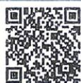
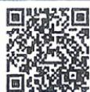

## 2.4.1 圆的标准方程

题型3 与面积有关的最值问题
专题④ 与圆有关的轨迹问题 …… 49
题型1 几何法求轨迹问题
题型2 代数法求轨迹问题
题型3 相关点法求轨迹问题
专题⑤ 求离心率的值或取值范围 …… 78
题型1 求a,b,c中任意两个的值
题型2 求a,b,c中任意两个的比值
题型3 构造a,c的齐次式
专题⑥ 圆锥曲线中的中点弦、对称问题 …… 79
题型1 中点弦问题
题型2 对称问题
专题⑦ 圆锥曲线中的范围、最值问题 …… 80
·角度1 利用基本不等式求范围或最值
·角度2 利用定义、几何性质求范围或最值
·角度3 利用函数的性质求范围或最值
专题⑧ 圆锥曲线中的定点、定值问题 …… 81
·角度1 证明直线过定点
·角度2 证明几何量为定值
专题⑨ 圆锥曲线中的存在、探索性问题 …… 82
·角度1 探索满足条件的点是否存在
·角度2 探索满足条件的直线是否存在
·角度3 探索满足条件的参数是否存在

## 重难就要刷又刷

狂K速览 找对重点不迷茫
单元高难问题1 空间中的探索性
问题 P21
拓展3 与直线有关的对称问题的
解决方法 P32
突破 利用直线的对称性解决距离
最值问题 P33
突破1 求解与圆有关的轨迹方程
问题的方法 P37
拓展4 求椭圆离心率的方法 P54
拓展3 求双曲线离心率的方法 P63
突破 椭圆的中点弦问题 P58
突破 双曲线的中点弦问题 P66
难点1 对称问题 P75
拓展5 利用圆锥曲线的定义或性
质求最值 P54
难点2 最值(取值范围)问题 P75
难点3 定点与定值问题 P77
难点4 探索性问题 P78

## 高考新动向·科技前沿、创新情境

AI 折纸术中的数学原理 …… P5 第 4 题
圆柱形水管上蚂蚁爬行路径问题 …… P8 第 11 题
堑堵中线线垂直的判定 …… P12 第 8 题
古代建筑攒尖结构的理解 …… P18 第 7 题
《九章算术》刍甍中的空间角问题 …… P19 第 9 题
包装盒体积与空间角的计算 …… P20 第 5 题
“阿基米德多面体”结构特征的理解 …… P24 第 11 题
“欧拉线”概念的理解与应用 …… P34 第 3 题
“将军饮马”问题中的最短路程问题 … P36 第 3 题
台球反弹与点关于直线对称的结合 …… P39 第 5 题

阿波罗尼斯圆的理解与应用 …… P43 第 6 题
太极图中的直线斜率最值问题 …… P45 第 15 题
机器人追及中的距离最值问题 …… P48 第 8 题
AI 生成的曲线特征的理解 …… P51 第 11 题
根据“埙”的结构求半椭圆的方程 …… P61 第 2 题
工业凹槽中圆与双曲线的位置关系 …… P70 第 4 题
“一箭七星”中卫星接收天线的结构特征 … P76 第 4 题
机器人运动轨迹中双纽线的理解 …… P85 第 11 题
求曲线狭缝玩具中孔隙的曲线方程 …… P93 第 6 题
达·芬奇方砖中的空间向量的应用 …… P96 第 10 题

## 高考新动向·模块融合

正弦型函数图象与空间距离、角的求解 … P20 第 6 题 与直线的位置关系有关的概率问题…… P51 第 13 题
已知截距的对数运算关系求直线斜率 … P32 第 5 题 三角函数与解析几何方程的含义 …… P63 第 3 题
正余弦定理与点的轨迹的综合 …… P49 第 6 题 已知投影向量的模求双曲线的离心率…… P66 第 10 题

## 高考新动向·新定义

向量新定义运算及其几何意义 …… P10 第 11 题 “最远距离直线”与解析几何的结合 … P59 第 8 题
平面法向量的理解与应用 …… P11 第 7 题 “黄金双曲线”定义的理解与应用 …… P68 第 8 题
利用平面的点法式方程求点到平面的距离 … P15 第 5 题 斜椭圆定义的理解与应用 …… P98 第 19 题

## 强基计划

【清华大学2024强基计划】正四面体中求向量数量积的最值 …… P5第8题
【2025重庆高中数学联赛初赛】四面体中求点到直线的距离 …… P15第9题
【2025全国高中数学联赛江苏赛区预赛】已知二面角求三棱锥的体积 …… P21第10题
【清华大学2024强基计划】点与直线、直线与直线位置关系的综合 …… P38第9题
【2024THUSSAT中学生标准学术能力诊断性测试】与圆有关的轨迹问题 …… P43第8题
【北京航空航天大学2025强基计划】已知圆的对称轴求参数范围 …… P43第9题
【清华大学2025强基计划】两圆相交求参数 …… P48第9题
【浙江大学2023强基计划】椭圆焦点弦性质的应用 …… P62第9题
【2023全国中学生数学奥林匹克竞赛（预赛）】圆与椭圆位置关系的综合 …… P62第10题
【山东大学2025强基计划】椭圆中三角形面积最值问题 …… P62第11题
【2025全国高中数学联赛吉林赛区预赛】双曲线焦点三角形的应用 …… P71第11题
【2025全国高中数学联赛福建赛区预赛】求双曲线的离心率 …… P71第12题
【清华大学2024强基计划】直线与抛物线的位置关系的综合应用 …… P77第13题

# 第一章

# 空间向量与立体几何

# 1.1 空间向量及其运算

# 1.1.1 空间向量及其线性运算

视频讲解

错题本
