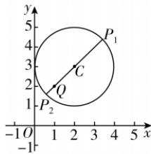

> [!faq]- 答案与解析
>
> > [!success]- **【答案】** C
>
> > [!note]- **【解析】**
> > C 【解析】将圆 $C: x^{2} + y^{2} - 4x - 6y + 9 = 0$ 化为标准方程，得 $(x - 2)^{2} + (y - 3)^{2} = 4$ ，故圆 C 的圆心为 $C(2, 3)$ ，半径 r = 2。因为 $(1 - 2)^{2} + (2 - 3)^{2} = 2 < 4$ ，所以点 $Q(1, 2)$ 在圆 C 的内部，且 $|CQ| = \sqrt{(1 - 2)^{2} + (2 - 3)^{2}} = \sqrt{2}$ ，所以 $|PQ|$ 的取值范围为 $[r - |CQ|, r + |CQ|] = [2 - \sqrt{2}, 2 + \sqrt{2}]$ 。
> >
> > 
