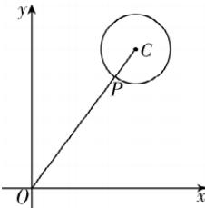

> [!faq]- 答案与解析
>
> > [!success]- **【答案】** C
>
> > [!note]- **【解析】**
> > C 【解析】设点 $P(x,y)$ ，点 O 为坐标原点，又圆 C 的圆心 $C(3,4)$ ，半径 r=1，则 $\left|PA\right|^{2}+\left|PB\right|^{2}=(x+1)^{2}+y^{2}+(x-1)^{2}+y^{2}=2\left(x^{2}+y^{2}\right)+2=2\left|PO\right|^{2}+2$ ，因为 $(0-3)^{2}+(0-4)^{2}>1$ ，所以原点 O 在圆 C 外，且 $\left|OC\right|=\sqrt{3^{2}+4^{2}}=5$ ，如图所示.
> >
> > 
> >
> > $|OP|\geqslant|OC|-r=5-1=4$ , 当且仅当点 P 为线段 OC 与圆 C 的交点时, 等号成立. 所以 $\left|PA\right|^{2}+\left|PB\right|^{2}=2\left|PO\right|^{2}+2\geqslant2\times4^{2}+2=34$ . 故选 C.
> >
> > 多种解法 由题知 $\overrightarrow{OA} = -\overrightarrow{OB}$ , $\angle POA = \pi - \angle POB, \overrightarrow{PA} = \overrightarrow{PO} + \overrightarrow{OA}, \overrightarrow{PB} = \overrightarrow{PO} + \overrightarrow{OB}$ , 则 $|PA|^2 + |PB|^2 = \overrightarrow{PA}^2 + \overrightarrow{PB}^2 = (\overrightarrow{PO} + \overrightarrow{OA})^2 + (\overrightarrow{PO} + \overrightarrow{OB})^2 = 2|\overrightarrow{PO}|^2 + |\overrightarrow{OA}|^2 + |\overrightarrow{OB}|^2 + 2\overrightarrow{PO} \cdot \overrightarrow{OA} + 2\overrightarrow{PO} \cdot \overrightarrow{OB} = 2|\overrightarrow{PO}|^2 + 2|\overrightarrow{OA}|^2$ , 又 $|\overrightarrow{OA}|^2 = 1$ , 故当 $|\overrightarrow{PO}|$ 最小时, $|PA|^2 + |PB|^2$ 最小, $|PO|_{\min} = |OC| - 1 = \sqrt{3^2 + 4^2} - 1 = 4$ , 此时 $|PA|^2 + |PB|^2 = 2 \times 4^2 + 2 = 34$ .
> >
> > 故选 **C**.
