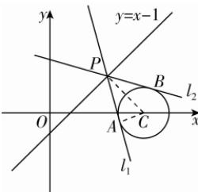

> [!faq]- 答案与解析
>
> > [!success]- **【答案】** B
>
> > [!note]- **【解析】**
> > B
> >
> > 
> >
> > 思路导引 根据切线长、圆的半径和圆心到点 P 的距离构成直角三角形，圆的半径固定，得出当圆心到点 P 的距离最小时，切线长最小，最后由圆心到直线上点 P 的最小距离就是圆心到直线的距离求解.
> >
> > 【解析】对于圆 $C: x^{2} + y^{2} = 1$ ，其圆心坐标为 $(0, 0)$ ，半径 r = 1。根据点 $(x_{0}, y_{0})$ 到直线 $Ax + By + C = 0$ 的距离公式 $d = \frac{|Ax_{0} + By_{0} + C|}{\sqrt{A^{2} + B^{2}}}$ ，可知圆 C 的圆心 $(0, 0)$ 到直线 l 的距离 $d = \frac{|2 \times 0 + 0 - 5|}{\sqrt{2^{2} + 1^{2}}} = \frac{5}{\sqrt{5}} = \sqrt{5}$ 。根据切线长、圆的半径和圆心到点 P 的距离构成直角三角形，设圆心到点 P 的距离为 $d_{1}$ ，由勾股定理可得 $|PA| = \sqrt{d_{1}^{2} - r^{2}}$ ，当 $d_{1}$ 取最小值 $\sqrt{5}$ 时， $|PA|$ 最小，此时 $|PA| = \sqrt{(\sqrt{5})^{2} - 1^{2}} = \sqrt{5 - 1} = \sqrt{4} = 2$ 。
> >
> > 故选 **B**。
