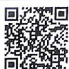
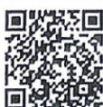

## 3.1.1 椭圆及其标准方程

视频讲解

错题本

## 刷基础

## 题型1 椭圆定义的理解

![[高中/课堂同步/教辅/必刷题/2027版 必刷题 数学选择性必修第一册RJA/01_第一章/3_1_1_椭圆及其标准方程/questions/Q00072244.md]]
![[高中/课堂同步/教辅/必刷题/2027版 必刷题 数学选择性必修第一册RJA/01_第一章/3_1_1_椭圆及其标准方程/questions/Q00072245.md]]
![[高中/课堂同步/教辅/必刷题/2027版 必刷题 数学选择性必修第一册RJA/01_第一章/3_1_1_椭圆及其标准方程/questions/Q00072246.md]]
![[高中/课堂同步/教辅/必刷题/2027版 必刷题 数学选择性必修第一册RJA/01_第一章/3_1_1_椭圆及其标准方程/questions/Q00072247.md]]
![[高中/课堂同步/教辅/必刷题/2027版 必刷题 数学选择性必修第一册RJA/01_第一章/3_1_1_椭圆及其标准方程/questions/Q00072248.md]]
![[高中/课堂同步/教辅/必刷题/2027版 必刷题 数学选择性必修第一册RJA/01_第一章/3_1_1_椭圆及其标准方程/questions/Q00072249.md]]
![[高中/课堂同步/教辅/必刷题/2027版 必刷题 数学选择性必修第一册RJA/01_第一章/3_1_1_椭圆及其标准方程/questions/Q00072250.md]]
![[高中/课堂同步/教辅/必刷题/2027版 必刷题 数学选择性必修第一册RJA/01_第一章/3_1_1_椭圆及其标准方程/questions/Q00072251.md]]
![[高中/课堂同步/教辅/必刷题/2027版 必刷题 数学选择性必修第一册RJA/01_第一章/3_1_1_椭圆及其标准方程/questions/Q00072252.md]]
![[高中/课堂同步/教辅/必刷题/2027版 必刷题 数学选择性必修第一册RJA/01_第一章/3_1_1_椭圆及其标准方程/questions/Q00072253.md]]
![[高中/课堂同步/教辅/必刷题/2027版 必刷题 数学选择性必修第一册RJA/01_第一章/3_1_1_椭圆及其标准方程/questions/Q00072254.md]]
![[高中/课堂同步/教辅/必刷题/2027版 必刷题 数学选择性必修第一册RJA/01_第一章/3_1_1_椭圆及其标准方程/questions/Q00072255.md]]
![[高中/课堂同步/教辅/必刷题/2027版 必刷题 数学选择性必修第一册RJA/01_第一章/3_1_1_椭圆及其标准方程/questions/Q00072256.md]]
![[高中/课堂同步/教辅/必刷题/2027版 必刷题 数学选择性必修第一册RJA/01_第一章/3_1_1_椭圆及其标准方程/questions/Q00072257.md]]
![[高中/课堂同步/教辅/必刷题/2027版 必刷题 数学选择性必修第一册RJA/01_第一章/3_1_1_椭圆及其标准方程/questions/Q00072258.md]]
![[高中/课堂同步/教辅/必刷题/2027版 必刷题 数学选择性必修第一册RJA/01_第一章/3_1_1_椭圆及其标准方程/questions/Q00072259.md]]
![[高中/课堂同步/教辅/必刷题/2027版 必刷题 数学选择性必修第一册RJA/01_第一章/3_1_1_椭圆及其标准方程/questions/Q00072260.md]]
