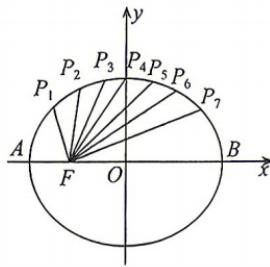

<!-- question-source:start -->
6. 如图, 把椭圆 $\frac{x^{2}}{25} + \frac{y^{2}}{16} = 1$ 的长轴 AB 分成 8 等份, 过每个分点作 x 轴的垂线交椭圆的上半部分于 $P_{1}, P_{2}, \cdots, P_{7}$ 七个点, F

是椭圆的左焦点, 则 $\left|P_{1}F\right| + \left|P_{2}F\right| + \cdots + \left|P_{7}F\right| =$ \_\_\_\_ .
<!-- question-source:end -->

![[Q00072258A1]]
