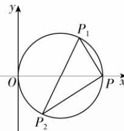

> [!faq]- 答案与解析
>
> > [!success]- **【答案】** A
>
> > [!note]- **【原始答案】** $(x-2)^{2}+(y-3)^{2}=13$ 或 $(x-2)^{2}+(y-1)^{2}=5$ 或 $\left(x-\frac{4}{3}\right)^{2}+\left(y-\frac{7}{3}\right)^{2}=\frac{65}{9}$ 或 $\left(x-\frac{8}{5}\right)^{2}+(y-1)^{2}=\frac{169}{25}$ （以上任一方程或对应的一般方程均可）
>
> > [!note]- **【解析】**
> > （圆的一般方程）：
> > 依题意设圆的一般方程为 $x^{2}+y^{2}+Dx+Ey+F=0, D^{2}+E^{2}-4F>0.$ (1) 若过点 $(0,0)$ ， $(4,0)$ ， $(-1,1)$ ，
> > 则 $\left\{\begin{aligned}&F=0,\\ &16+4D+F=0,\\ &1+1-D+E+F=0,\end{aligned}\right.$ 解得 $\left\{\begin{aligned}&F=0,\\ &D=-4,\\ &E=-6.\end{aligned}\right.$ 所以圆的方程为 $x^{2}+y^{2}-4x-6y=0$ ，即 $(x-2)^{2}+(y-3)^{2}=13.$
> >
> > 所以圆 C 的标准方程为 $(x-1)^{2}+y^{2}=1$ .
> >
> > (2)①由(1)知 $P(2,0)$ ，因为 $k_{1}\cdot k_{2}=-1$ ，所以 $P_{1}P\perp P_{2}P$ ，从而直线 $P_{1}P_{2}$ 经过圆心 C， $\triangle PP_{1}P_{2}$ 是直角三角形，且 $|P_{1}P_{2}|=2$ ，设 $|P_{1}P|=a,|P_{2}P|=b$ ，则 $a^{2}+b^{2}=4$ ，又 $4=a^{2}+b^{2}\geqslant2ab$ ，所以 $ab\leqslant2$ ，当且仅当 $a=b=\sqrt{2}$ 时取等号，所以 $(S_{\triangle PP_{1}P_{2}})_{\max}=\frac{1}{2}ab=1$ .
> > - **②**：由已知得，直线 $P_{1}P_{2}$ 的斜率必存在，
> >
> > 点悟：若直线 $P_{1}P_{2}$ 的斜率不存在，则 $k_{1}\cdot k_{2}$ 为负值
> >
> > 设直线 $P_{1}P_{2}$ 的方程为 $y=kx+m$ ， $P_{1}(x_{1},y_{1}),P_{2}(x_{2},y_{2})$ ，
> >
> > 由 $\left\{\begin{aligned}y=kx+m,\\ (x-1)^{2}+y^{2}=1,\end{aligned}\right.$ 消去 y 并化简得 $(k^{2}+1)x^{2}+2(km-1)x+m^{2}=0$ ，
> >
> > 易知 $\Delta>0,x_{1}+x_{2}=-\frac{2(km-1)}{k^{2}+1},x_{1}x_{2}=\frac{m^{2}}{k^{2}+1},(\text{※})$ 又 $k_{1}\cdot k_{2}=\frac{y_{1}}{x_{1}-2}\cdot\frac{y_{2}}{x_{2}-2}=\frac{(kx_{1}+m)(kx_{2}+m)}{(x_{1}-2)(x_{2}-2)}=$
> >
> > ## 第二章高考强化
> >
> > (2)若过点 $(0,0),(4,0),(4,2)$ ，则 $\left\{ \begin{array}{l}F = 0,\\ 16 + 4D + F = 0,\\ 16 + 4 + 4D + 2E + F = 0, \end{array} \right.$ 解得 $\left\{ \begin{array}{l}F = 0,\\ D = -4,\\ E = -2. \end{array} \right.$ 所以圆的方程为 $x^{2} + y^{2} - 4x - 2y = 0$ ，即 $(x - 2)^{2} + (y - 1)^{2} = 5.$ (3)若过点 $(0,0),(-1,1),(4,2)$ 则 $\left\{ \begin{array}{l}F = 0,\\ 1 + 1 - D + E + F = 0,\\ 16 + 4 + 4D + 2E + F = 0, \end{array} \right.$ 解得 $\left\{ \begin{array}{l}F = 0,\\ D = -\frac{8}{3},\\ E = -\frac{14}{3}. \end{array} \right.$ 所以圆的方程为 $x^{2} + y^{2} - \frac{8}{3} x - \frac{14}{3} y =$ $0$ ，即 $\left(x - \frac{4}{3}\right)^2 +\left(y - \frac{7}{3}\right)^2 = \frac{65}{9}.$ (4)若过点 $(-1,1),(4,0),(4,2)$ 则 $\left\{ \begin{array}{l}1 + 1 - D + E + F = 0,\\ 16 + 4D + F = 0,\\ 16 + 4 + 4D + 2E + F = 0, \end{array} \right.$ 解得 $\left\{ \begin{array}{l}F = -\frac{16}{5},\\ D = -\frac{16}{5},\\ E = -2. \end{array} \right.$ 所以圆的方程为 $x^{2}+$ $\frac{k^{2}x_{1}x_{2}+km(x_{1}+x_{2})+m^{2}}{x_{1}x_{2}-2(x_{1}+x_{2})+4}=4,$ 即 $(4-k^{2})x_{1}x_{2}-(km+8)(x_{1}+x_{2})+16-m^{2}=0$ ，把（※）代入得， $3m^{2}+14km+16k^{2}=0$ ，
> > 即 $(m+2k)(3m+8k)=0$ ，解得 $m=-2k$ 或 $m=-\frac{8}{3}k.$ 当 m=-2k 时，此时直线 $P_{1}P_{2}$ 的方程为 $y=k(x-2)$ ，过定点 $P(2,0)$ ，不符合要求，舍去；
> > 当 $m=-\frac{8}{3}k$ 时，此时直线 $P_{1}P_{2}$ 的方程为 $y=k(x-\frac{8}{3})$ ，过定点 $\left(\frac{8}{3},0\right)$ ，符合要求.
> > 故当 $k_{1}\cdot k_{2}=4$ 时，动弦 $P_{1}P_{2}$ 过定点 $\left(\frac{8}{3},0\right)$ .
> >
> > 
> >
> > $y^{2} - \frac{16}{5} x - 2y - \frac{16}{5} = 0$ ，即 $\left(x - \frac{8}{5}\right)^2 + (y - 1)^2 = \frac{169}{25}.$
> >
> > 多种解法 设点 $A(0,0), B(4,0), C(-1,1), D(4,2)$ . (1) 若圆过 $A, B, C$ 三点，则圆心在直线 $x = 2$ 上，设圆心坐标为 $(2, a)$ ，则 $4 + a^2 = 9 + (a - 1)^2 \Rightarrow a = 3, r = \sqrt{4 + a^2} = \sqrt{13}$ ，所以圆的方程为 $(x - 2)^2 + (y - 3)^2 = 13$ . (2) 若圆过 $A, B, D$ 三点，设圆心坐标为 $(2, a)$ ，则 $4 + a^2 = 4 + (a - 2)^2 \Rightarrow a = 1, r = \sqrt{4 + a^2} = \sqrt{5}$ ，所以圆的方程为 $(x - 2)^2 + (y - 1)^2 = 5$ . (3) 若圆过 $A, C, D$ 三点，则线段 $AC$ 的垂直平分线的方程为 $y = x + 1$ ，线段 $AD$ 的垂直平分线方程为 $y = -2x + 5$ ，联立 $\left\{\begin{array}{l} y = x + 1, \\ y = -2x + 5, \end{array}\right.$ 解得 $\left\{\begin{array}{l} x = \frac{4}{3}, \\ y = \frac{7}{3}, \end{array}\right.$ 所以 $r = \frac{\sqrt{65}}{3}$ ，所以圆的方程为 $\left(x - \frac{4}{3}\right)^2 + \left(y - \frac{7}{3}\right)^2 = \frac{65}{9}$ . (4) 若圆过 $B, C, D$ 三点，则线段 $BD$ 的垂直平分线的方程为 y=1，线段 BC 的垂直平分线的方程为 y=5x-7，联立 $\left\{\begin{aligned}y&=1,\\ y&=5x-7,\end{aligned}\right.$ 解得 $\left\{\begin{aligned}x=\frac{8}{5},\\ y=1,\end{aligned}\right.$ 所以 $r=\frac{13}{5}$ ，所以圆的方程为 $\left(x-\frac{8}{5}\right)^{2}+(y-1)^{2}=\frac{169}{25}$ .
