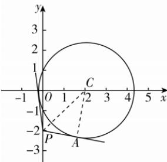

> [!faq]- 答案与解析
>
> > [!success]- **【答案】** B
>
> > [!note]- **【解析】**
> > B 【解析】设圆 $x^{2}+y^{2}-4x-1=0$ 为圆 C，化简得 $(x-2)^{2}+y^{2}=5$ ，圆心为 $C(2,0)$ ，半径 $r=\sqrt{5}$ 。如图，设 $\angle CPA=\theta$ ，则 $\alpha=2\theta,\sin\theta=\frac{|CA|}{|CP|}=\frac{\sqrt{5}}{\sqrt{(2-0)^{2}+[0-(-2)]^{2}}}=\frac{\sqrt{5}}{2\sqrt{2}}$ ，易知 $\cos\theta>0$ ，则 $\cos\theta=\frac{\sqrt{3}}{2\sqrt{2}}$ ，所以 $\sin\alpha=$ → 点 悟： $\theta\in\left(0,\frac{\pi}{2}\right)$ $\sin 2\theta = 2\sin \theta \cos \theta = \frac{\sqrt{15}}{4}$ . 故选 B.
> >
> > 
