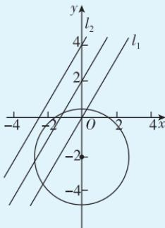

> [!faq]- 答案与解析
>
> > [!success]- **【答案】** B
>
> > [!note]- **【解析】**
> > B 【解析】由题易知圆心(0,-2)到直线 $y = \sqrt{3} x + 2$ 的距离 $d = \frac{|0-(-2)+2|}{\sqrt{(\sqrt{3})^{2}+(-1)^{2}}} = 2$ ，因为圆上到直线 $y = \sqrt{3} x + 2$ 的距离为 1 的点有且仅有两个，所以 $|d - r| < 1$ ，即 $|2 - r| < 1$ ，所以 1 < r < 3，故选 B.
> >
> > 多种解法 设与直线 $y=\sqrt{3}x+2$ 距离为 1 的平行直线的方程为 $y=\sqrt{3}x+c(c\neq2)$ ，由 $\frac{|c-2|}{2}=1$ 得 c=0 或 4，记 $l_{1}:y=\sqrt{3}x, l_{2}:y=\sqrt{3}x+4$ ，则圆与 $l_{1}, l_{2}$ 共有两个交点，由于圆心 $(0,-2)$ 位于直线 $l_{1}$ 下方，所以圆只能与 $l_{1}$ 相交且与 $l_{2}$ 相离，所以 $\frac{|\sqrt{3}\times0-(-2)|}{2}<r<\frac{|\sqrt{3}\times0-(-2)+4|}{2}$ ，即 1<r<3。故选 B.
> >
> > 
> >
> > 快解 （特殊值法）圆心 $(0,-2)$ 到直线 $y=\sqrt{3}x+2$ 的距离 $d=\frac{|0-(-2)+2|}{\sqrt{(\sqrt{3})^{2}+(-1)^{2}}}=2$ ，当 r=1 时，圆上有一个点到直线 $y=\sqrt{3}x+2$ 的距离为 1，当 r=3 时，圆上有三个点到直线 $y=\sqrt{3}x+2$ 的距离为 1，所以要使圆上有且仅有两个点到直线 $y=\sqrt{3}x+2$ 的距离为 1，则 1<r<3。故选 B.
> >
> > 链接教材 本题是教材第99页习题2.5第13题的变式与延伸,考查圆上到某条直线的距离为定值的点的个数问题,可以转化为与该直线平行且到该直线距离为定值的直线与圆的交点个数问题,也可以根据圆心到直线的距离与圆的半径的大小关系判断.
