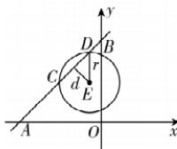

> [!faq]- 答案与解析
>
> > [!success]- **【答案】** A
>
> > [!note]- **【原始答案】** 2
>
> > [!note]- **【解析】**
> > 如图, 设圆 $(x+1)^{2}+(y-3)^{2}=r^{2}$ 的圆心为E，则点 $E(-1,3)$ 到直线
> >
> > 
> >
> > $AB$ 的距离 $d = \frac{| - 1 - 3 + 6|}{\sqrt{2}} = \sqrt{2}$ 易知 $|AB| = 6\sqrt{2}$ ，又 $|AB| = 3|CD|$ 则 $|CD| = 2\sqrt{2}$ 所以 $r^2 = d^2 +\left(\frac{|CD|}{2}\right)^2 = 2 + 2 = 4,$ 解得 $r = 2.$
