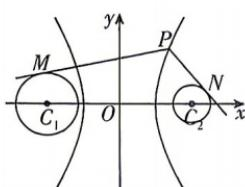

<!-- question-source:start -->
5.[江西南昌2026高二期中]过双曲线 $\frac{x^2}{4} -\frac{y^2}{12} = 1$ 的右支上一点 $P$ ，分别向 $\odot C_1:(x + 4)^2 +y^2 = 3$ 和 $\odot C_2:(x - 4)^2 +y^2 = 1$ 作切线，切点分别为 $M,N,$ 则 $(\overrightarrow{PM} +\overrightarrow{PN})\cdot \overrightarrow{NM}$ 的最小值为（）

A. 28 B. 30 C. 31 D. 32
<!-- question-source:end -->

![[Q00072324A1]]
