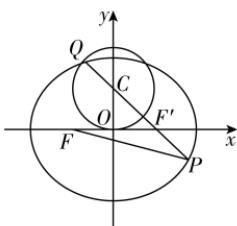

> [!faq]- 答案与解析
>
> > [!success]- **【答案】** D
>
> > [!note]- **【解析】**
> > D 【解析】设椭圆 $\frac{x^{2}}{4}+\frac{y^{2}}{3}=1$ 的另一个焦点为 $F'(1,0)$ ，圆的圆心为 $C(0,1)$ ，其半径r=1，
> > 那么 $|PF|+|PF'|=2a=4$ ，所以 $|PF|=4-|PF'|$ ，所以 $|PQ|+|PF|=4+|PQ|-|PF'|$ ，所以要求 $|PQ|+|PF|$ 的最大值，即求 $4+|PQ|-|PF'|$ 的最大值。因为 $|PQ|-|PF'|\leqslant|QF'|$ ，所以当P,Q, $F'$ 三点共线时（ $F'$ 在线段PQ上）， $|PQ|-|PF'|$ 取得最大值，最大值为 $|QF'|$ 。而 $|QF'|_{\max}=|CF'|+r=\sqrt{2}+1$ ，所以 $|PQ|+|PF|$ 的最大值，即 $4+|PQ|-|PF'|$ 的最大值为 $4+\sqrt{2}+1=5+\sqrt{2}$ 。故选D。
> >
> > 
