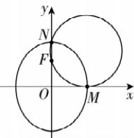

> [!faq]- 答案与解析
>
> > [!success]- **【答案】** B
>
> > [!note]- **【解析】**
> > B 【解析】由已知可得 $M(b,0)$ , $N(0,a), F(0,c)$ ,
> >
> > 
> >
> > 线段 NF 的垂直平分线方程为 $y = \frac{a + c}{2}$ ，因为过 M, N, F 三点的圆恰与 x 轴相切，所以圆心坐标为 $\left(b, \frac{a + c}{2}\right)$ ，圆的半径为 $\frac{a + c}{2}$ ，所以经过 M, N, F 三点
> >
> > 点悟：与 x 轴的切点是点 M，圆心是线段 NF 的垂直平分线和过点 M 与 x 轴垂直的直线的交点
> >
> > 的圆的方程为 $(x - b)^{2} + \left(y - \frac{a + c}{2}\right)^{2} = \left(\frac{a + c}{2}\right)^{2}$ ， $N(0, a)$ 在圆上，所以 $(0 - b)^{2} + \left(a - \frac{a + c}{2}\right)^{2} = \left(\frac{a + c}{2}\right)^{2}$ ，整理得 $b^{2} = ac$ ，所以 $a^{2} - c^{2} = ac$ ，所以 $c^{2} + ac - a^{2} = 0$ ，化为 $e^{2} + e - 1 = 0$ ，又 0 < e < 1，解得 $e = \frac{\sqrt{5} - 1}{2}$ 。故选 B.
> >
> > 思路导引 设与直线 $l:4x-5y+41=0$ 平行的直线的方程为 $4x-5y+m=0$ ( $m\neq41$ ), 然后联立直线与椭圆方程, 整理出关于 x 的一元二次方程, 令其判别式为 0, 求出 m, 然后根据平行直线间距离公式求出 $d_{1}$ , $d_{2}$ , 进而求得答案.
> >
> > 【解析】设与直线 $l:4x-5y+41=0$ 平行的直线的方程为 $4x-5y+m=0$ ( $m\neq41$ ). 联立该直线方程与椭圆方程并消去 y 得到 $9x^{2}+25\left(\frac{4x+m}{5}\right)^{2}=225$ ，化简得 $25x^{2}+8mx+m^{2}-225=0$ . 若该直线与椭圆相切，则 $\Delta=64m^{2}-4\times25\times(m^{2}-225)=0$ ，解得 m=25 或 m=-25，所以该直线方程为 $4x-5y+25=0$ 或 $4x-5y-25=0$ . 根据平行直线间的距离公式可得 $d_{1}=\frac{|41-25|}{\sqrt{4^{2}+5^{2}}}=\frac{16}{\sqrt{41}}$ , $d_{2}=\frac{|41+25|}{\sqrt{4^{2}+5^{2}}}=\frac{66}{\sqrt{41}}$ . 所以 $d_{1}+d_{2}=\frac{16+66}{\sqrt{41}}=2\sqrt{41}$ .
> >
> > 故选 **A**.
