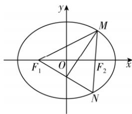

> [!faq]- 答案与解析
>
> > [!success]- **【答案】** B
>
> > [!note]- **【解析】**
> > B【解析】点 $F_{1}$ 关于 $\angle F_{1}MF_{2}$ 的平分线的对称点 $N$ 必在 $MF_{2}$ 上，因此点 $M,F_2,N$ 共线， $\vert MF_1\vert = \vert MN\vert ,\vert MF_1\vert +$ $\vert MF_2\vert = 2a$ ，设 $\vert MF_1\vert = m(0 <   m <   2a)$ ，则 $\vert MF_2\vert = 2a - m,\vert MN\vert = m,$ $\vert NF_2\vert = \vert MN\vert -\vert MF_2\vert = 2m - 2a$ ，又 $\vert NF_1\vert +\vert NF_2\vert = 2a$ ，故 $\vert NF_1\vert = 4a - 2m.$ 在△ $MF_{1}N$ 中，由余弦定理得 $\vert NF_1\vert^2 =$ $\vert MF_1\vert^2 +\vert MN\vert^2 -2\vert MF_1\vert \mid MN\mid$ · $\cos \angle F_{1}MF_{2}$ 即 $(4a - 2m)^{2} = m^{2} + m^{2} - 2m^{2}\times \frac{7}{9}$ 化简并整理得 $2m^{2} - 9am + 9a^{2} = 0$ ，解得 $m =$ $3a$ （舍去）或 $m = \frac{3}{2} a$ ，故 $\vert MF_1\vert =$ $\frac{3}{2} a,\vert MF_2\vert = \frac{1}{2} a.$ 在△ $MF_{1}F_{2}$ 中， $\vert F_1F_2\vert = 2c$ ，由余弦定理得 $(2c)^{2} = \left(\frac{3}{2} a\right)^{2} + \left(\frac{1}{2} a\right)^{2} - 2\times \frac{3}{2} a\times$ $\frac{1}{2} a\times \frac{7}{9}$ 解得 $e = \frac{c}{a} = \frac{\sqrt{3}}{3}$ 故选B.
> >
> > 
