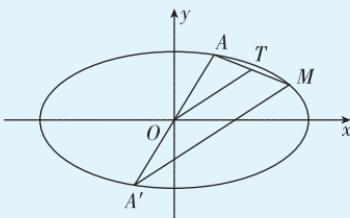

> [!faq]- 答案与解析
>
> > [!success]- **【答案】** B
>
> > [!note]- **【解析】**
> > B 【解析】设 $A(x_{1},y_{1}),B(x_{2},y_{2})$ ，将直线方程与椭圆方程联立 $\left\{ \begin{array}{l}y = \frac{1}{2} x + 1,\\ \frac{x^2 + y^2}{a^2} = 1, \end{array} \right.$ 消去 $x$ 得 $(4b^{2} + a^{2})y^{2} - 8b^{2}y + 4b^{2} - a^{2}b^{2} = 0,$ 其中 $\Delta = (-8b^{2})^{2} - 4(4b^{2} + a^{2})(4b^{2}-$ $a^2 b^2) = 4a^2 b^2(a^2 +4b^2 -4) > 0$ ，即 $a^2+$ $4b^{2} > 4$ ，则 $y_{1} + y_{2} = \frac{8b^{2}}{4b^{2} + a^{2}}.$ 因为线段 $AB$ 的中点为 $M\left(-1,\frac{1}{2}\right)$ ，所以 $\frac{y_1 + y_2}{2} = \frac{1}{2}$ ，解得 $4b^{2} = a^{2}$ 所以 $e^2 = \frac{c^2}{a^2} = \frac{a^2 - b^2}{a^2} = 1 - \frac{b^2}{a^2} = \frac{3}{4}$ 即 $e=$ $\frac{\sqrt{3}}{2}$ 故选B.二级结论 (1)椭圆 $\frac{x^2}{a^2} +\frac{y^2}{b^2} = 1(a>$ $b > 0)$ 的弦所在直线与“中心线”（弦中点与中心连线）的斜率之积为 $-\frac{b^2}{a^2} = e^2 -1.$ (2)椭圆 $\frac{x^2}{a^2} +\frac{y^2}{b^2} = 1(a > b > 0)$ 上的点与过中心的弦的端点的连线斜率之积为 $-\frac{b^2}{a^2} = e^2 -1.$ 如图， $T$ 是 $AM$ 的中点，则 $OT$ 是 $\triangle A'AM$ 的中位线，则 $OT / / MA'$ 从而 $k_{MA}\cdot k_{MA'} = k_{MA}\cdot k_{OT} = -\frac{b^2}{a^2} = e^2 -1.$
> >
> > 
> >
> > 本题也可利用（1）中结论，求出 $a^2, b^2$ 关系后，得 $e^2 - 1 = -\frac{1}{4}$ ，解得 $e = \frac{\sqrt{3}}{2}$ .
