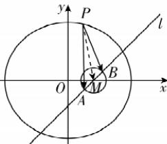

> [!faq]- 答案与解析
>
> > [!success]- **【答案】** B
>
> > [!note]- **【解析】**
> > B【解析】 $\odot M:(x-2)^{2}+y^{2}=1$ 的圆心为 $M(2,0)$ , 半径为 1.
> >
> > 在椭圆 $\frac{x^{2}}{25}+\frac{y^{2}}{21}=1$ 中, $a^{2}=25$ , $b^{2}=21$ , $c^{2}=a^{2}-b^{2}=4$ , 所以 $a=5$ , $c=2$ , 故圆心 $M$ 为椭圆的右焦点. 由题意, $AB$ 是圆 $M$ 的直径, 所以 $M$ 为 $AB$ 的中点, 且 $|\overrightarrow{AB}|=2$ , 所以 $\overrightarrow{MA}=-\overrightarrow{MB}$ . 如图, 连接 $PM$ , 可得 $\overrightarrow{PA}\cdot\overrightarrow{PB}=(\overrightarrow{PM}+\overrightarrow{MA})\cdot(\overrightarrow{PM}+\overrightarrow{MB})=(\overrightarrow{PM}-\overrightarrow{MB})\cdot(\overrightarrow{PM}+\overrightarrow{MB})=|\overrightarrow{PM}|^{2}-|\overrightarrow{MB}|^{2}=|\overrightarrow{PM}|^{2}-1$ .
> >
> > 因为点 $P$ 为椭圆 $\frac{x^{2}}{25}+\frac{y^{2}}{21}=1$ 上任意一点, 所以 $|\overrightarrow{PM}|_{\min}=a-c=3$ , $|\overrightarrow{PM}|_{\max}=a+c=7$ .
> >
> > 由 $3\leqslant|\overrightarrow{PM}|\leqslant7$ , 得 $\overrightarrow{PA}\cdot\overrightarrow{PB}=|\overrightarrow{PM}|^{2}-1\in[8,48]$ . 故选 B.
> >
> > 
