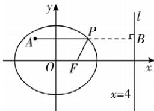

> [!faq]- 答案与解析
>
> > [!success]- **【答案】** ABC
>
> > [!note]- **【解析】**
> > ABC 【解析】对于 A, 设 $P(x, y)$ ，因为点 P 到点 F 的距离是点 P 到直线 l 的距离的一半，所以 $2\sqrt{(x-1)^{2}+y^{2}}=|x-4|$ ，化简可得 $\frac{x^{2}}{4}+\frac{y^{2}}{3}=1$ ，所以点 P 的轨迹方程是 $\frac{x^{2}}{4}+\frac{y^{2}}{3}=1$ ，故 A 正确；对于 B，联立 $\left\{\begin{aligned}&x+2y-4=0,\\ &\frac{x^{2}}{4}+\frac{y^{2}}{3}=1,\end{aligned}\right.$ 可得 $(x-1)^{2}=0$ ，解得 x=1，故存在点 $P\left(1, \frac{3}{2}\right)$ ，所以直线 $l_{1}: x+2y-4=0$ 是“最远距离直线”，故 B 正确；对于 C，过点 P 作 PB 垂直于直线 l，垂足为 B，
> >
> > 
> >
> > 由题意可得， $|PB|=2|PF|$ ，则 $|PA|+2|PF|=|PA|+|PB|$ ，
> > 由图可知， $|PA|+|PB|$ 的最小值即为点A到直线l:x=4的距离，为5，故C正确；
> >
> > 对于 D, 由圆 $C: x^{2} + y^{2} - 2x = 0$ 可得 $(x - 1)^{2} + y^{2} = 1$ , 即圆心为 $(1, 0)$ , 半径为 1, 易得点 P 的轨迹与圆 C 交于点 $(2, 0)$ , 故 D 错误.
> >
> > 故选 **ABC**.
