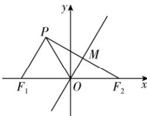

> [!faq]- 答案与解析
>
> > [!success]- **【答案】** A
>
> > [!note]- **【解析】**
> > A 【解析】如图所示, 设 $F_{2}$ 关于渐近线的对称点为 P, 易知 $\left|OF_{2}\right| = \left|OP\right| = \left|OF_{1}\right| = \left|F_{1}P\right|$ , 所以 $\triangle PF_{1}F_{2}$ 为直角三角形, $\angle F_{1}PF_{2} = \frac{\pi}{2}$ , $\triangle PF_{1}O$ 是等边
> >
> > 点悟: 直角三角形斜边的中线等于斜边的一半
> >
> > 三角形. 又 $PF_{2} \perp OM$ , 则 $F_{1}P \parallel OM$ , 所以 $\angle MOF_{2} = \angle PF_{1}F_{2} = \frac{\pi}{3}$ ,
> >
> > 故双曲线一条渐近线的倾斜角为 $\frac{\pi}{3}$ , 即 $\frac{b}{a} = \tan \frac{\pi}{3} = \sqrt{3}$ , 所以离心率 e = $\frac{c}{a} = \sqrt{1 + \frac{b^{2}}{a^{2}}} = 2$ , 故选 A.
> >
> > 
