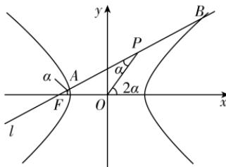
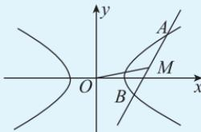

> [!faq]- 答案与解析
>
> > [!success]- **【答案】** C
>
> > [!note]- **【解析】**
> > C 【解析】如图，设 $A(x_{1}, y_{1})$ ， $B(x_{2}, y_{2})$ ， $x_{1} \neq x_{2}$ ， $P(x_{0}, y_{0})$ ， $x_{0} \neq 0$ ，由 A, B 均在 $C: \frac{x^{2}}{4} - \frac{y^{2}}{3} = 1$ 上，P 为 AB 的中点，得 $\left\{\begin{aligned}&3x_{1}^{2}=12+4y_{1}^{2},\\ &3x_{2}^{2}=12+4y_{2}^{2},\end{aligned}\right.$ 则 $3(x_{1}-x_{2}) \cdot (x_{1}+x_{2}) = 4(y_{1}-y_{2})(y_{1}+y_{2}), \therefore \frac{3}{4} = \frac{y_{1}-y_{2}}{x_{1}-x_{2}} \cdot \frac{y_{1}+y_{2}}{x_{1}+x_{2}} = \frac{y_{1}-y_{2}}{x_{1}-x_{2}} \cdot \frac{2y_{0}}{2x_{0}} = \frac{y_{1}-y_{2}}{x_{1}-x_{2}} \cdot \frac{y_{0}-0}{x_{0}-0}, \therefore k_{OP} \cdot k_{AB} = \frac{3}{4}.$ 设直线 AB 的倾斜角为 $\alpha$ ，则 $k_{AB} = \tan \alpha$ ，不妨设 $\alpha$ 为锐角，∵ $\triangle OFP$ 是以 FP 为底边的等腰三角形，∴ 直线 OP 的倾斜角为 $2\alpha$ ，则 $k_{OP} = \tan 2\alpha, \therefore \tan \alpha \cdot \tan 2\alpha = \frac{3}{4}, \therefore \tan \alpha \cdot \frac{2\tan \alpha}{1-\tan^{2}\alpha} = \frac{3}{4}$ ，解得 $\tan \alpha = \frac{\sqrt{33}}{11}.$ ∴ 由双曲线的对称性知直线 l 的斜率为 $\pm\frac{\sqrt{33}}{11}.$ 故选 C.
> >
> > 
> >
> > 二级结论 如图, 已知直线 l 与双曲线相交于 A, B 两点, 点 M 为 AB 的中点, O 为原点, 则 $k_{OM} \cdot k_{AB} = \frac{b^{2}}{a^{2}} = e^{2} - 1$ .
> >
> > 
> >
> > 若直线 l 与双曲线的两条渐近线相交于 A, B 两点, 其他条件不变, 结论依然成立.
