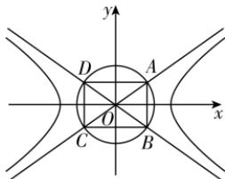

> [!faq]- 答案与解析
>
> > [!success]- **【答案】** B
>
> > [!note]- **【解析】**
> > B【解析】因为双曲线 $\Gamma : \frac{x^2}{a^2} - \frac{y^2}{b^2} = 1$ 的离心率为 $\frac{\sqrt{6}}{2}$ , 所以 $e = \frac{c}{a} = \sqrt{1 + \frac{b^2}{a^2}} = \frac{\sqrt{6}}{2}$ , 得 $\frac{b}{a} = \frac{\sqrt{2}}{2}$ , 所以双曲线 $\Gamma$ 的渐近线方程为 $y = \pm \frac{\sqrt{2}}{2} x$ . 设直线 $y = \frac{\sqrt{2}}{2} x$ 的倾斜角为 $\theta$ , 则 $\tan \theta = \frac{\sqrt{2}}{2}$ , 由双曲线及圆的对称性不妨令点 $A, B$ 分别在第一、四象限，坐标原点为 $O$ ，则 $\angle AOB = 2\theta$
> >
> > 
> >
> > 于是得 $\sin\angle AOB=\sin2\theta=2\sin\theta\cos\theta=\frac{2\sin\theta\cos\theta}{\sin^{2}\theta+\cos^{2}\theta}=\frac{2\tan\theta}{\tan^{2}\theta+1}=\frac{2\sqrt{2}}{3}$ ，而双曲线的虚半轴长为 b，即 $|OA|=|OB|=b$ ，显然四边形 ABCD 为矩形，其面积 $S=4S_{\triangle AOB}=4\times\frac{1}{2}|OA|^{2}\sin\angle AOB=\frac{4\sqrt{2}}{3}b^{2}=12\sqrt{2}$ ，得 $b^{2}=9$ ，所以 $a^{2}=2b^{2}=18$ ，所以双曲线的方程为 $\frac{x^{2}}{18}-\frac{y^{2}}{9}=1$ 。
> >
> > 故选 **B**.
