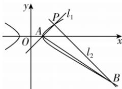

> [!faq]- 答案与解析
>
> > [!success]- **【答案】** A
>
> > [!note]- **【原始答案】** 5
>
> > [!note]- **【解析】**
> > 将点 $P(2,1)$ 的坐标代入 C 的方程中，可得方程成立，故点 P 在双曲线 C 上。过点 $P(2,1)$ 且倾斜角为 $\frac{\pi}{4}$ 的直线 $l_{1}$ 的斜率 $k_{1}=\tan\frac{\pi}{4}=1$ ，则 $l_{1}$ 的方程为 y-1=x-2，即 y=x-1，代入 C 的方程 $x^{2}-3y^{2}=1$ 中，化简可得 $x^{2}-3x+2=0$ ，解得 x=1 或 x=2，当 x=1 时，y=0，故点 A 的坐标为 $(1,0)$ 。过点 $P(2,1)$ 且倾斜角为 $\frac{3\pi}{4}$ 的直线 $l_{2}$ 的斜率 $k_{2}=\tan\frac{3\pi}{4}=-1$ ，则 $l_{2}$ 的方程为 $y-1=-(x-2)$ ，即 $y=-x+3$ ，代入 C 的方程 $x^{2}-3y^{2}=1$ 中，化简可得 $x^{2}-9x+14=0$ ，解得 x=2 或 x=7，当 x=7 时，y=-4，故点 B 的坐标为 $(7,-4)$ 。因为 $k_{1}k_{2}=-1$ ，所以 $PA\perp PB$ ，所以 $\triangle PAB$ 是直角三角形，且 $|PA|=\sqrt{(2-1)^{2}+(1-0)^{2}}=\sqrt{2}$ ， $|PB|=\sqrt{(2-7)^{2}+[1-(-4)]^{2}}=5\sqrt{2}$ ，故 $S_{\triangle PAB}=\frac{1}{2}\cdot|PA|\cdot|PB|=5$ 。
> >
> > 
