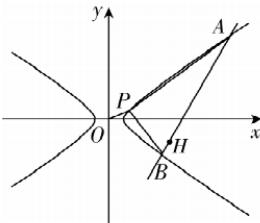

> [!faq]- 答案与解析
>
> > [!success]- **【答案】** A
>
> > [!note]- **【原始答案】** $4\sqrt{2}$
>
> > [!note]- **【解析】**
> > 设 $P(a,b)(a > 0,b>$ 0)，由 $\vert OP\vert = \sqrt{5}$ ，得 $\sqrt{a^2 + b^2} = \sqrt{5}$ ，故 $a^2 +b^2 = 5①$ 又 $P(a,b)$ 在双曲线 $\frac{x^2}{2} -y^2 = 1$ 上，所以 $\frac{a^2}{2} -b^2 = 1②$ ，由 $①②$ 可得 $a^2 = 4$ $b^{2} = 1$ 所以 $a = 2,b = 1$ ，故 $P(2,1)$ 联立 $\left\{\frac{x^2}{2} -y^2 = 1,\right.$ 消去 $y$ 整理得 $(1 - 2k^{2})\cdot x^{2} - 4kmx - 2m^{2} - 2 = 0,$ $\Delta = 8(m^2 +1 - 2k^2) > 0.$ 设 $A(x_{1},y_{1}),B(x_{2},y_{2})$ ，则 $x_{1} + x_{2} =$ $\frac{4km}{1 - 2k^2},x_1x_2 = -\frac{2m^2 + 2}{1 - 2k^2}.$ 因为 $\angle APB = 90^{\circ}$ ，所以 $\overrightarrow{PA}\cdot \overrightarrow{PB} =$ $(x_{1}-2)(x_{2}-2)+(y_{1}-1)(y_{2}-1)=0,$ 得 $(k^{2}+1)x_{1}x_{2}+(km-k-2)(x_{1}+x_{2})+m^{2}-2m+5=0,$ 所以 $(k^{2}+1)\left(-\frac{2m^{2}+2}{1-2k^{2}}\right)+(km-k-2)\cdot\frac{4km}{1-2k^{2}}+m^{2}-2m+5=0,$ 得 $12k^{2}+8mk+(m+3)(m-1)=0$ ，即 $(6k+m+3)(2k+m-1)=0$ ，
> > 当 $2k+m-1=0$ ，即 m=-2k+1 时，直线 AB:y=kx-2k+1 过定点 P(2,1)，不符合题意；
> > 当 $6k+m+3=0$ ，即 m=-6k-3 时，直线 AB:y=kx-6k-3 过定点 H(6,-3)，符合题意.
> > 则点 P 到 l 的距离的最大值为 $|PH|=\sqrt{(2-6)^{2}+(1+3)^{2}}=4\sqrt{2}.$
> >
> > 
