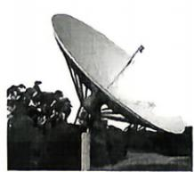
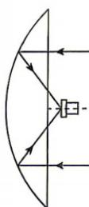

<!-- question-source:start -->
3.[山西大学附属中学2026高二段考]已知点P是抛物线 $C:y^{2}=12x$ 上的一点,设点P到直线x=-3和 $x-y+4=0$ 的距离分别为 $d_{1},d_{2}$ ,则 $d_{1}+d_{2}$ 的最小值为()A. $\frac{7\sqrt{2}}{2}$ B. $\frac{7}{2}$ C. $3+2\sqrt{2}$ D. $4\sqrt{2}$

4. 2026 年 2 月捷龙三号运载火箭以“一箭七星”的方式将 7 颗卫星准确送入预定轨道, 发射任务取得圆满成功. 某种卫星接收天线 (如图①所示) 的曲面与轴截面的交线为抛物线, 在轴截面内的卫星波束呈近似平行状态射入形为抛物线的接收天线, 经反射聚焦到焦点处 (如图②所示). 已知接收天线的口径 (直径) 为 $3.6 \mathrm{~m}$ , 深度为 $0.6 \mathrm{~m}$ , 则该抛物线的焦点到顶点的距离为 ( )

图①
图②

A. 1.35 m B. 2.05 m C. 2.7 m D. 5.4 m 我们最坏的习惯, 是苟安于当下生活, 不知道明天的方向。

建议用时:65 分钟 答案 P184
<!-- question-source:end -->

![[Q00072430A1]]
