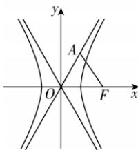

> [!faq]- 答案与解析
>
> > [!success]- **【答案】** D
>
> > [!note]- **【解析】**
> > D 【解析】因为 $\triangle OAF$ 是边长为 2 的等边三角形, 所以 $c = |OF| = 2$ .
> > 不妨令点 A 在第一象限, 又 $\angle AOF = 60^{\circ}$ , 所以渐近线 OA 的斜率 $k_{OA} = \frac{b}{a} = \tan 60^{\circ} = \sqrt{3}$ .
> > 因为 $\left\{\begin{aligned}\frac{b}{a}&=\sqrt{3},\\ c&=\sqrt{a^{2}+b^{2}}=2,\end{aligned}\right.$ 解得 $\left\{\begin{aligned}a&=1,\\ b&=\sqrt{3},\end{aligned}\right.$ 所以双曲线的方程为 $x^{2}-\frac{y^{2}}{3}=1$ . 故选 D.
> >
> > 
