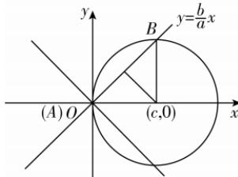

> [!faq]- 答案与解析
>
> > [!success]- **【答案】** B
>
> > [!note]- **【解析】**
> > B 【解析】如图所示, 双曲线的两条渐近线关于 x 轴对称, 取直线 $y = \frac{b}{a}x$ 与圆相交于点 A, B, $|AB| = 2b$ , 圆心 $(c, 0)$ 到直线 bx - ay = 0 的距离 $d = \frac{|bc|}{\sqrt{a^2 + b^2}} = b$ , 结合垂径定理得 $2a^2 = b^2 + b^2$ , 即 a = b, 所以双曲线 C 是等轴双曲线, 离心率为 $\sqrt{2}$ , 故选 B.
> >
> > 
> >
> > 二级结论 双曲线 $\frac{x^2}{a^2} - \frac{y^2}{b^2} = 1 (a > 0, b > 0)$ 的焦点到渐近线的距离为 $b$ . 证明: 不妨设双曲线的一个焦点为 $F(c, 0)$ , 一条渐近线方程为 $bx - ay = 0$ , 则焦点到渐近线的距离 $d = \frac{|bc - 0|}{\sqrt{a^2 + b^2}} = b$ .
