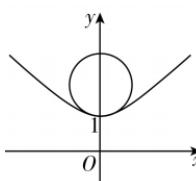

> [!faq]- 答案与解析
>
> > [!success]- **【答案】** A
>
> > [!note]- **【解析】**
> > A
> >
> > 思路导引 设小球的截面圆圆心, 双曲线上的点的坐标, 求出点到圆心的距离的平方 $d^{2}$ , 根据 $d^{2}$ 的最小值在点 $(0,1)$ 处取到, 进而求出 $y_{0}$ 的范围, 即可求出半径的最大值.
> >
> > 【解析】由题意画出轴截面如图所示.
> >
> > 设小球的截面圆圆心为 $(0, y_{0})$ $(y_{0}>1)$ ，双曲线上的点的坐标为 $(x, y)$ $(y \geqslant 1)$ ，则
> >
> > 
> >
> > 点 $(x,y)$ 到圆心的距离的平方 $d^2 = x^2 +$ $(y - y_0)^2 = y^2 -1 + (y - y_0)^2 = 2y^2 -2y_0y+$ $y_0^2 -1$ ，曲线 $t = 2y^{2} - 2y_{0}y + y_{0}^{2} - 1$ 的对称轴为直线 $y = \frac{y_0}{2}$ .若清洁钢球能擦净凹槽的最底部，则小球触及最底部，即 $d^2$ 最小值在 $y = 1$ 时取得，故二次函数 $t =$ $2y^{2} - 2y_{0}y + y_{0}^{2} - 1$ 图象的对称轴在直线 $y = 1$ 的左边，所以 $\frac{y_0}{2}\leqslant 1$ ，则 $y_0\leqslant 2$ ，则 $1 <   y_0\leqslant 2.$ 所以清洁钢球的半径 $r$ 满足 $0 < r\leqslant 2 - 1 = 1$ ，即清洁钢球的最大半径为1.
> >
> > 故选 **A**.
