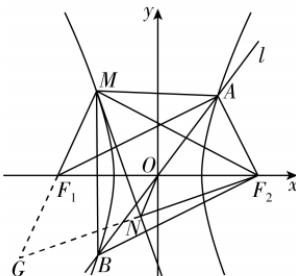

> [!faq]- 答案与解析
>
> > [!success]- **【答案】** BCD
>
> > [!note]- **【解析】**
> > BCD 【解析】依题意得直线 $y=\frac{4}{3}x$ 与双曲线的两交点 A, B 关于原点对称，不妨设 A 在第一象限，因为 $\overrightarrow{F_{2}A}\cdot\overrightarrow{F_{2}B}=0$ ，所以 $F_{2}A\perp F_{2}B$ 。设 $F_{2}(c,0)$ ，则 $|OA|=c$ ，由直线 l 的斜
> >
> > 点悟：根据直角三角形中斜边的中线等于斜边的一半而得到
> >
> > 率为 $\frac{4}{3}$ 可知 $\tan\angle AOF_{2}=\frac{4}{3}$ ，则 $\sin\angle AOF_{2}=\frac{4}{5}$ ， $\cos\angle AOF_{2}=\frac{3}{5}$ ，则 $A\left(\frac{3}{5}c,\frac{4}{5}c\right)$ ，
> >
> > 代入双曲线方程有 $\frac{9c^{2}}{25a^{2}}-\frac{16c^{2}}{25b^{2}}=1$ ，
> >
> > 即 $\frac{9c^{2}}{25a^{2}}-\frac{16c^{2}}{25(c^{2}-a^{2})}=1$ ，化简得
> >
> > $9e^{2}-\frac{16e^{2}}{e^{2}-1}=25$ ，即 $9e^{4}-50e^{2}+25=0$ ，
> > 又 e>1，解得 $e^{2}=5$ ，则 $e=\sqrt{5}$ ，故 A 错误；
> > 因为 $e=\frac{c}{a}=\sqrt{\frac{a^{2}+b^{2}}{a^{2}}}=\sqrt{1+\frac{b^{2}}{a^{2}}}=\sqrt{5}$ ，所以 $\frac{b}{a}=2$ ，所以双曲线 E 的渐近线方程是 $y=\pm2x$ ，故 B 正确；
> > 根据 $b^{2}=4a^{2}$ ，双曲线方程可化为 $x^{2}-\frac{y^{2}}{4}=a^{2}$ ，设 $A(x_{1},y_{1})$ ， $M(x_{0},y_{0})$ ，根据对称性得 $B(-x_{1},-y_{1})$ ，
> > 由点 A, M 在双曲线 E 上，得 $\left\{\begin{aligned}&x_{0}^{2}-\frac{y_{0}^{2}}{4}=a^{2},①\\&x_{1}^{2}-\frac{y_{1}^{2}}{4}=a^{2},②\end{aligned}\right.$ ①-②得 $x_{0}^{2}-x_{1}^{2}=\frac{y_{0}^{2}-y_{1}^{2}}{4}$ ,
> > 即 $\frac{y_{0}^{2}-y_{1}^{2}}{x_{0}^{2}-x_{1}^{2}}=4$ , $k_{AM}k_{BM}=\frac{y_{0}-y_{1}}{x_{0}-x_{1}}\cdot\frac{y_{0}+y_{1}}{x_{0}+x_{1}}=\frac{y_{0}^{2}-y_{1}^{2}}{x_{0}^{2}-x_{1}^{2}}=4$ ，故 C 正确；
> >
> > 
> >
> > 作点 $F_{2}$ 关于 $\angle F_{1}MF_{2}$ 的平分线 MN 的对称点 G，则点 G 在 $MF_{1}$ 的延长线上，连接 GN, $GF_{1}$ ，
> > 故 $\left|F_{1}G\right|=\left|MF_{2}\right|-\left|MF_{1}\right|=2a,$ → 点悟：MN 是线段 $F_{2}G$ 的垂直平分线，所以 $\left|MG\right|=\left|MF_{2}\right|$ 又 ON 是 $\triangle F_{2}F_{1}G$ 的中位线，
> > 故 $|ON|=a$ ,
> > 因为 $|ON|=1$ ，所以 a=1，所以双曲线方程为 $x^{2}-\frac{y^{2}}{4}=1$ 所以 $c=\sqrt{5}$ ，则 $A\left(\frac{3\sqrt{5}}{5},\frac{4\sqrt{5}}{5}\right)$ ，
> > 又 $\left|F_{1}F_{2}\right|=2c=2\sqrt{5}$ 所以 $S_{\triangle AF_{1}F_{2}}=\frac{1}{2}\times2\sqrt{5}\times\frac{4\sqrt{5}}{5}=4$ ，故 D 正确.
> >
> > 故选 **BCD**.
