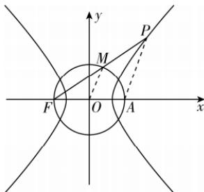

> [!faq]- 答案与解析
>
> > [!success]- **【答案】** A
>
> > [!note]- **【原始答案】** $\frac{\sqrt{11}}{5}$ 或 $\sqrt{35}$
>
> > [!note]- **【解析】**
> > 由双曲线 $\frac{x^2}{4} -\frac{y^2}{5} = 1$ 可知 $a = 2,b = \sqrt{5},c =$ $\sqrt{a^2 + b^2} = 3.$ 若点 $P$ 在第一象限，如图，设线段 $PF$ 的中点为 $M$ ，双曲线的右焦点为 $A$ ，连接 $OM,PA$ ，则 $|OM| = 3,|AF| = 6$ ，则 $|PA| = 2|OM| = 6,|PF| = |PA|+$ $4 = 10$
> >
> > 
> >
> > 故 $\cos\angle PFA=\frac{|PF|^{2}+|AF|^{2}-|AP|^{2}}{2|PF|\cdot|AF|}=\frac{10^{2}+6^{2}-6^{2}}{2\times10\times6}=\frac{5}{6}$ ，且 $\angle PFA$ 为锐角，则 $\sin\angle PFA=\sqrt{1-\cos^{2}\angle PFA}=\frac{\sqrt{11}}{6}$ ，可得 $\tan\angle PFA=\frac{\sin\angle PFA}{\cos\angle PFA}=\frac{\sqrt{11}}{5}$ ，所以直线 PF 的斜率为 $\frac{\sqrt{11}}{5}$ .
> > 若点 P 在第二象限，设 $P(s,t)$ (s < 0, t > 0)，则线段 PF 的中点为 $M\left(\frac{s-3}{2},\frac{t}{2}\right)$ ，易知圆 O 的方程为 $x^{2}+y^{2}=9$ ，
> > 由 $\left\{\begin{aligned}\frac{(s-3)^{2}}{4}+\frac{t^{2}}{4}&=9,\\ \frac{s^{2}}{4}-\frac{t^{2}}{5}&=1,\\ s<0,\\ t>0,\end{aligned}\right.$ 解得 $\left\{\begin{aligned}s&=-\frac{8}{3},\\ t&=\frac{\sqrt{35}}{3},\end{aligned}\right.$ 此时直线 PF 的斜率为 $\frac{t}{s+3}=\sqrt{35}$ .
