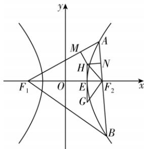

> [!faq]- 答案与解析
>
> > [!success]- **【答案】** A
>
> > [!note]- **【解析】**
> > A 【解析】由题意, 在 $C: \frac{x^{2}}{a^{2}} - \frac{y^{2}}{b^{2}} = 1$ $(a > 0, b > 0)$ 中，根据焦点到渐近线的距离为 $\sqrt{6}$ 可得 $b = \sqrt{6}$ ，又离心率为 $2, \therefore e = \frac{c}{a} = \sqrt{1 + \frac{b^2}{a^2}} = \sqrt{1 + \frac{6}{a^2}} = 2$ ，解得 $a = \sqrt{2}, \therefore c = \sqrt{b^2 + a^2} = 2\sqrt{2}, \therefore$ 双曲线 $C$ 的方程为 $\frac{x^2}{2} - \frac{y^2}{6} = 1$ . 记 $\triangle AF_1F_2$ 的内切圆在边 $AF_1, AF_2, F_1F_2$ 上的切点分别为 $M, N, E$ ，则 $H, E$ 的横坐标相等， $|AM| = |AN|$ , $|F_1M| = |F_1E|$ , $|F_2N| = |F_2E|$ ，由 $|AF_1| - |AF_2| = 2a$ ，得 $|AM| + |MF_1| - (|AN| + |F_2N|) = 2a$ ，得 $|MF_1| - |F_2N| = 2a$ ，则 $|F_1E| - |F_2E| = 2a$ . 记 $H$ 的横坐标为 $x_0$ ，则 $E(x_0, 0)$ ，于是 $x_0 + c - (c - x_0) = 2a$ ，得 $x_0 = a$ ，同理点 $G$ 的横坐标也为 $a$ ，故 $HG \perp x$ 轴. 设直线 $AB$ 的倾斜角为 $\theta$ ，则 $\angle OF_2G = \frac{\theta}{2}, \angle HF_2O = 90^\circ - \frac{\theta}{2}$ （ $O$ 为坐标原点），在 $\triangle HF_2G$ 中， $|HG| = (c - a) \left[\tan \frac{\theta}{2} + \tan \left(90^\circ - \frac{\theta}{2}\right)\right] = (c - a) \cdot \left(\frac{\sin \frac{\theta}{2}}{\cos \frac{\theta}{2}} + \frac{\cos \frac{\theta}{2}}{\sin \frac{\theta}{2}}\right) = (c - a) \cdot \frac{2}{\sin \theta} = \frac{2\sqrt{2}}{\sin \theta}$ . 由于直线 $l$ 与 $C$ 的右支交于两点，且 $C$ 的渐近线的斜率为 $\pm \frac{b}{a} = \pm \sqrt{3}$ ，倾斜角为 $60^\circ, 120^\circ, \therefore 60^\circ < \theta < 120^\circ$ ，即 $\frac{\sqrt{3}}{2} < \sin \theta \leqslant 1, \therefore |HG|$ 的取值范围是 $\left[2\sqrt{2}, \frac{4\sqrt{6}}{3}\right)$ . 故选 A.
> >
> > 
