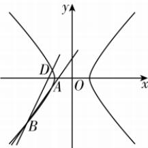

> [!faq]- 答案与解析
>
> > [!success]- **【答案】** A
>
> > [!note]- **【原始答案】** 详见解析
>
> > [!note]- **【解析】**
> > (1)【解】由题意可知 $\frac{b}{a} = \frac{\sqrt{2}}{2}, 2a = 2\sqrt{2}$ , 解得 $a = \sqrt{2}, b = 1$ , 所以双曲线 $C$ 的方程为 $\frac{x^2}{2} - y^2 = 1$ .
> >
> > (2) (i)【解】联立 $\left\{ \begin{array}{l} x + 1 = my, \\ \frac{x^2}{2} - y^2 = 1, \end{array} \right.$ 得 $(m^2 - 2)x^2 - 4x - 2 - 2m^2 = 0$ , 因为直线 $l: x + 1 = my$ 与双曲线 $C$ 的左支交于 $A, B$ 两点, 所以 $\left\{ \begin{array}{l} m^2 - 2 \neq 0, \\ \Delta = 8m^4 - 8m^2 > 0, \\ \frac{4}{m^2 - 2} < 0, \\ \frac{-2 - 2m^2}{m^2 - 2} > 0, \end{array} \right.$ 解
> >
> > 点悟: $A, B$ 位于双曲线左支, 横坐标均小于 0 , 则对应方程两根之和小于 0 , 两根之积大于 0
> >
> > 得 $-\sqrt{2}<m<-1$ 或 $1<m<\sqrt{2}$ ，故实数m的取值范围为 $(- \sqrt{2},-1) \cup (1,\sqrt{2})$ .
> > (ii)【证明】设 $A(x_{1},y_{1}), B(x_{2},y_{2})$ ，则 $D(x_{1},-y_{1})$ ，由(i)可知 $x_{1}+x_{2}=\frac{4}{m^{2}-2}, x_{1}x_{2}=\frac{-2-2m^{2}}{m^{2}-2}$ 直线 BD 的方程为 $\frac{y+y_{1}}{y_{2}+y_{1}}=\frac{x-x_{1}}{x_{2}-x_{1}}$ ，即 $\frac{y+\frac{x_{1}+1}{m}}{\frac{x_{2}+1}{m}+\frac{x_{1}+1}{m}}=\frac{x-x_{1}}{x_{2}-x_{1}}$ ，令 y=0 可得 $x=\frac{(x_{1}+1)(x_{2}-x_{1})}{x_{2}+x_{1}+2}+x_{1}=\frac{2x_{1}x_{2}+x_{1}+x_{2}}{x_{2}+x_{1}+2}$ ，把 $x_{1}+x_{2}=\frac{4}{m^{2}-2}, x_{1}x_{2}=\frac{-2-2m^{2}}{m^{2}-2}$ 代入可
> > 得 $x = \frac{\frac{-4-4m^{2}}{m^{2}-2} + \frac{4}{m^{2}-2}}{\frac{4}{m^{2}-2} + 2} = \frac{-4m^{2}}{2m^{2}} = -2$ ，即直线 BD 恒过点 $(-2,0)$ ，所以直线 BD 过 x 轴上一定点，该定点的坐标为 $(-2,0)$ .
> >
> > 
> > 第3.2节综合训练
> >
> > ## 刷能力
