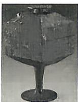
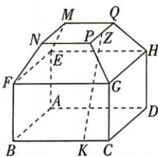

<!-- question-source:start -->
2.[福建福州八县2026高二期中联考]青铜豆最早见于商代晚期,盛行于春秋战国时期,它不仅可以作为盛放食物的铜器,还是一件十分重要的礼器.图①为河南出土的战国青铜器——方豆,豆盘以上是长方体容器和正四棱台的斗形盖.图②是与主体结构相似的几何体,其中AB=4,MN=BF=2, $FN=\sqrt{3}$ ,点K为BC上一点,且 $\frac{KC}{BC}=\frac{1}{4}$ ,点Z为PQ的中点,则异面直线KZ与FN夹角的余弦值为()

图①

图②

A. $\frac{5\sqrt{39}}{39}$ B. $\frac{2\sqrt{39}}{13}$ C. $\frac{5\sqrt{13}}{26}$ D. $\frac{2\sqrt{13}}{13}$

√ 答案 P203
<!-- question-source:end -->

![[Q00072508A1]]
