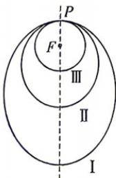

<!-- question-source:start -->
7.（多选）如图所示，探月卫星沿地月转移轨道飞向月球，在月球附近一点 $P$ 变轨进入以月球球心 $F$ 为一个焦点的椭圆轨道I绕月飞行，之后卫星在 $P$ 点第二次变轨进入仍以 $F$ 为一个焦点的椭圆轨道II绕月飞行，最终卫星在 $P$ 点第三次变轨进入以 $F$ 为圆心的圆形轨道III绕月飞行.若用 $2c_{1}$ 和 $2c_{2}$ 分别表示椭圆轨道I和II的焦距，用 $2a_{1}$ 和 $2a_{2}$ 分别表示椭圆轨道I和II的长轴的长，给出下列式子： $① a _ { 1 } + c _ { 1 } = a _ { 2 } + c _ { 2 } ; ② a _ { 1 } - c _ { 1 } = a _ { 2 } - c _ { 2 } ; ③ c _ { 1 } a _ { 2 } > a _ { 1 } c _ { 2 } ;$ $④ \frac{c_1}{a_1} < \frac{c_2}{a_2}$ .其中正确的式子是 （）

A. ①
B. ②
C. ③
D. ④
<!-- question-source:end -->

![[Q00072513A1]]
