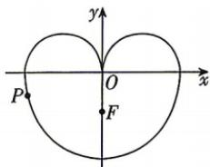

<!-- question-source:start -->
9. (多选) [江西南昌 2026 高二期中] 如图, 类似 “心形” 的曲线 E, 可以看成由上部分曲线 $C_{1}$ : $y = \sqrt{-x^{2} + 2|x|}$ , 下部分曲线 $C_{2} : \frac{y^{2}}{a^{2}} + \frac{x^{2}}{b^{2}} = 1 (y \leqslant 0)$ 构成, 曲线 $C_{2}$ 的一个焦点为 $F(0, -1)$ , $P(x, y)$ 是 “心形” 曲线 E 上的动点, 下列说法正确的是 ()

A. 曲线 $C_{2}$ 的方程为 $\frac{y^{2}}{5} + \frac{x^{2}}{4} = 1 (y \leqslant 0)$ B. $x^{2}+(y-1)^{2}$ 的最大值为 $1+\sqrt{5}$ C. 若直线 $y=x+m$ 与曲线 E 有 2 个交点，则实数 m 的取值范围为 $(-3,0)\cup(\sqrt{2}-1,\sqrt{2}+1)$ D. 曲线 $C_{2}$ 上的点到直线 y = x - 8 的距离的最小值是 $\frac{5\sqrt{2}}{2}$
<!-- question-source:end -->

![[Q00072515A1]]
