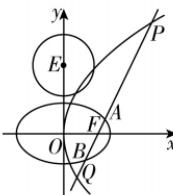
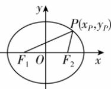

> [!faq]- 答案与解析
>
> > [!success]- **【答案】** C
>
> > [!note]- **【解析】**
> > C 【解析】设直线 $y=x+m$ 与 x 轴交于点 $M(-m,0)$ ，直线方程与椭圆方程联立得 $\frac{4x^{2}}{3}+2mx+m^{2}-1=0,\Delta=(2m)^{2}-4\cdot\frac{4}{3}\cdot(m^{2}-1)>0$ ，解得 -2<m<2。设$\sqrt{-y^{2}-8y+24}=\sqrt{-(y+4)^{2}+40}$ ，因为 $-2\leqslant y\leqslant2$ ，所以当y=-2时， $|ME|_{\max}=6$ ，所以 $|MN|_{\max}=|ME|_{\max}+\sqrt{3}=6+\sqrt{3}$ .
> >
> > (3)由题意得直线l的倾斜角不为0，故设直线l的方程为 $x=ty+2,A(x_{1},y_{1})$ ， $B(x_{2},y_{2})$ ， $P(x_{3},y_{3})$ ， $Q(x_{4},y_{4})$ .
> >
> > 
> >
> > 联立 $\left\{\begin{aligned}x&=ty+2,\\ \frac{x^{2}}{8}&+\frac{y^{2}}{4}=1,\end{aligned}\right.$ 消去 x 并整理，得 $(t^{2}+2)y^{2}+4ty-4=0,$ 所以 $\Delta_{1}=16t^{2}+16(t^{2}+2)=32(t^{2}+1)>0,y_{1}+y_{2}=-\frac{4t}{t^{2}+2},y_{1}y_{2}=-\frac{4}{t^{2}+2}.$ 所以 $\left|AB\right|=\sqrt{1+t^{2}}\sqrt{(y_{1}+y_{2})^{2}-4y_{1}y_{2}}=\sqrt{1+t^{2}}\sqrt{\frac{16t^{2}}{(t^{2}+2)^{2}}+\frac{16}{t^{2}+2}}$ $=\frac{4\sqrt{2}(t^{2}+1)}{t^{2}+2}.$
> >
> > ## 第三章高考强化
> >
> > $F_{1}(-\sqrt{2},0)$ , $F_{2}(\sqrt{2},0)$ 到直线 AB 的距离分别为 $d_{1}, d_{2}$ ，由题意得， $2 \cdot \frac{1}{2} \cdot |AB| \cdot d_{2} = \frac{1}{2} \cdot |AB| \cdot d_{1}$ ，所以 $d_{1} = 2d_{2}$ 。由三角形相似可得， $\frac{d_{1}}{d_{2}} = \frac{|F_{1}M|}{|F_{2}M|} = \frac{|\sqrt{-\sqrt{2}} + m|}{|\sqrt{2} + m|} = 2$ ，解得 $m = -\frac{\sqrt{2}}{3}$ 或 $m = -3\sqrt{2}$ 。
> >
> > 
