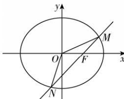
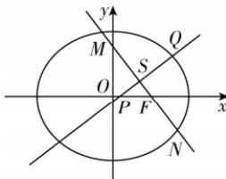

> [!faq]- 答案与解析
>
> > [!success]- **【答案】** C
>
> > [!note]- **【解析】**
> > 【解】(1)设椭圆 C 的标准方程为 $\frac{x^{2}}{a^{2}} + \frac{y^{2}}{b^{2}} = 1 (a > b > 0)$ ，由题意可知，椭圆 C 的左焦点 $F_{1}(-1,0)$ ，点 A 在椭圆 C 上，则 $\left|AF_{1}\right| + \left|AF\right| = 2a$ ，又 $\sqrt{\left(-1+1\right)^{2}+\left(\frac{3}{2}\right)^{2}} + \sqrt{\left(-1-1\right)^{2}+\left(\frac{3}{2}\right)^{2}} = 4$ ， $\therefore a = 2, b = \sqrt{4-1} = \sqrt{3}$ ，故椭圆 C 的标准方程为 $\frac{x^{2}}{4} + \frac{y^{2}}{3} = 1$ .
> >
> > (2)(i)由题设，当直线 l 的斜率不存在时， $|MN| = 3$ ，则 $S_{\triangle MON} = \frac{1}{2} \times 1 \times 3 = \frac{3}{2}$ ，不符合题意；
> >
> > 当直线 l 的斜率存在时，设直线 l 的方程为 $y = k(x - 1) (k \neq 0)$ ， $M(x_{1}, y_{1})$ ， $N(x_{2}, y_{2})$ ，
> >
> > 由 $\left\{\begin{aligned} y &= k(x - 1), \\ 3x^{2} + 4y^{2} &= 12 \end{aligned}\right. \Rightarrow (3 + 4k^{2})x^{2} - 8k^{2}x + 4k^{2} - 12 = 0, \Delta > 0,$ 则 $x_{1} + x_{2} = \frac{8k^{2}}{4k^{2} + 3}, x_{1}x_{2} = \frac{4k^{2} - 12}{4k^{2} + 3}$ 则 $|MN| = \sqrt{1 + k^{2}} \times \sqrt{(x_{1} + x_{2})^{2} - 4x_{1}x_{2}} = \sqrt{1 + k^{2}} \cdot \frac{12\sqrt{k^{2} + 1}}{4k^{2} + 3} = \frac{12(k^{2} + 1)}{4k^{2} + 3},$
> >
> > ## 第三章素养检测
> >
> > 椭圆,则 $\left\{\begin{aligned}&4a>0,\\ &2-3a>0,\quad 解得 0<a<\frac{2}{3}且\\ &4a\neq2-3a,\end{aligned}\right.$
> >
> > 又原点 O 到直线 l 的距离 $d=\frac{|k|}{\sqrt{k^{2}+1}}$ , $\therefore S_{\triangle MON} = \frac{1}{2} |MN| \times d = 6 \frac{|k| \sqrt{k^{2}+1}}{4k^{2}+3} = \frac{6\sqrt{2}}{7}$ ,
> > 解得 $k = \pm 1, \therefore$ 直线 l 的方程为 x - y - 1 = 0 或 $x + y - 1 = 0$ .
> >
> > 
> >
> > (ii) 设线段 MN 的中点为 S，则直线 SP 为线段 MN 的垂直平分线，由 (i) 知 $x_{1} + \rightarrow$ 敲黑板：通过菱形的性质得到，将几何知识与代数运算联系起来求解 $x_{2} = \frac{8k^{2}}{4k^{2} + 3}, x_{1}x_{2} = \frac{4k^{2} - 12}{4k^{2} + 3}$ 故 $x_{s} = \frac{4k^{2}}{4k^{2} + 3}$ ，故 $y_{s} = \frac{-3k}{4k^{2} + 3}$ ，分析知 $k \neq 0$ ，故直线 SP 的方程为 $y = -\frac{1}{k}\left(x - \frac{4k^{2}}{4k^{2} + 3}\right) - \frac{3k}{4k^{2} + 3}$ ，令 y = 0，则 $x_{0} = \frac{k^{2}}{4k^{2} + 3}$ ，故 $x_{Q} = \frac{7k^{2}}{4k^{2} + 3}, y_{Q} = \frac{-6k}{4k^{2} + 3}$ ，而点 Q 在椭圆 C 上，故 $\frac{49k^{4}}{4(4k^{2} + 3)^{2}} + \frac{36k^{2}}{3(4k^{2} + 3)^{2}} = 1$ ，整理得 $5k^{4} + 16k^{2} + 12 = 0$ ，该方程无解，故不存在满足条件的点 $P(x_{0}, 0)$ .
> >
> > 
> >
> > 归纳总结 存在性问题通常采用“肯定顺推法”，将不确定性问题明朗化.一般步骤为： $①$ 假设满足条件的元素（点、直线、曲线或参数)存在； $②$ 用待定系数法设出相关量； $③$ 通过分析列出关于待定系数的方程组，若方程组有实数解，则元素（点、直线、曲线或参数）存在，否则元素不存在.注：反证法与验证法也是求解存在性问题常用的方法. $a \neq \frac{2}{7}$ ，可知 $0 < a < \frac{2}{3}$ 是“曲线 $C$ 是椭圆”的必要不充分条件.
> >
> > 故选 **C**.
