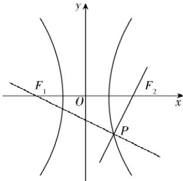

> [!faq]- 答案与解析
>
> > [!success]- **【答案】** A
>
> > [!note]- **【解析】**
> > A 【解析】如图，由 $k_{PF_{2}}=2$ ，点 P 在双曲线右支上及 $\triangle PF_{1}F_{2}$ 是直角三角形可得， $\angle F_{1}PF_{2}=\frac{\pi}{2}$ 。由直线 $PF_{2}$ 的斜率为 $2, F_{2}(c,0)$ ，得直线 $PF_{2}$ 的方程为 $y=2(x-c)$ ，则直线 $PF_{1}$ 的方程为 $y=-\frac{1}{2}(x+c)$ ，两方程联立解得 $x=\frac{3}{5}c, y=-\frac{4}{5}c$ ，所以点 P 的坐标为 $\left(\frac{3}{5}c,-\frac{4}{5}c\right)$ 。因为 $\triangle PF_{1}F_{2}$ 的面积为 8，所以 $\frac{1}{2}\cdot2c\cdot\frac{4}{5}c=8$ ，解得 $c^{2}=10$ 。所以 $\frac{\left(\frac{3}{5}c\right)^{2}}{a^{2}}-\frac{\left(-\frac{4}{5}c\right)^{2}}{c^{2}-a^{2}}=1$ ，即 $\frac{18}{5a^{2}}-\frac{32}{5(10-a^{2})}=1$ ，化简得 $a^{4}-20a^{2}+36=0$ ，解得 $a^{2}=2$ 或 $a^{2}=18$ （舍）。所以 $b^{2}=c^{2}-a^{2}=8$ ，所以双曲线的方程为 $\frac{x^{2}}{2}-$
> >
> > $\frac{y^{2}}{8}=1$ , 故选 A.
> >
> > 
> >
> > 多种解法 同上得 $c^{2}=10,\angle F_{1}PF_{2}=\frac{\pi}{2}$ . 由双曲线的焦点三角形面积公式 $S=\frac{b^{2}}{\tan\frac{\angle F_{1}PF_{2}}{2}}$ 及 $\triangle PF_{1}F_{2}$ 的面积为 8, 得 $b^{2}=8$ , 所以 $a^{2}=c^{2}-b^{2}=2$ , 所以双曲线的方程为 $\frac{x^{2}}{2}-\frac{y^{2}}{8}=1$ ,
> >
> > 故选 **A**.
