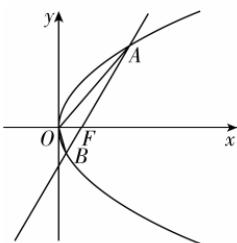

> [!faq]- 答案与解析
>
> > [!success]- **【答案】** BC
>
> > [!note]- **【解析】**
> > BC 【解析】由题意知, $F(2,0)$ ,则抛物线 $C: y^{2} = 8x$ , 准线方程为 x = -2, 又过点 F 的直线斜率为 $\sqrt{3}$ , 所以直线的方程为 $y = \sqrt{3}x - 2\sqrt{3}$ .
> >
> > 
> >
> > 设 $B(x_{1},y_{1}),A(x_{2},y_{2})$ ，联立直线与抛物线的方程 $\left\{ \begin{array}{l}y = \sqrt{3} x - 2\sqrt{3},\\ y^2 = 8x, \end{array} \right.$ 解得 $\left\{ \begin{array}{l}x = \frac{2}{3},\\ y = -\frac{4\sqrt{3}}{3} \end{array} \right.$ 或 $\left\{ \begin{array}{l}x = 6,\\ y = 4\sqrt{3}. \end{array} \right.$ 不妨令点 $A(6,4\sqrt{3})$ ，点 $B\left(\frac{2}{3},-\frac{4\sqrt{3}}{3}\right)$ ，则 $|AB| = x_1 + 2 + x_2 + 2 = \frac{20}{3} +$ $4 = \frac{32}{3},$ $S_{\triangle AOB} = \frac{1}{2}|OF|\times |y_1 - y_2| = \frac{1}{2}\times 2\times$ $\frac{16\sqrt{3}}{3} = \frac{16\sqrt{3}}{3}$ ，故B,C正确；又 $\tan \angle AOF = k_{OA} = \frac{2\sqrt{3}}{3},\tan \angle BOF =$ $-k_{OB} = 2\sqrt{3}$ ，所以 $\tan \angle AOF\neq$ $\tan \angle BOF$ ，故 $\angle AOF\neq \angle BOF$ ，故A错误；因为 $\overrightarrow{OA} = (6,4\sqrt{3}),\overrightarrow{OB} =$ $\left(\frac{2}{3}, - \frac{4\sqrt{3}}{3}\right)$ ，所以 $\overrightarrow{OA}\cdot \overrightarrow{OB} = (6,$ $4\sqrt{3})\cdot \left(\frac{2}{3}, - \frac{4\sqrt{3}}{3}\right) = 4 - 16 = -12 <   0,$ 所以∠AOB为钝角，故D错误.
> >
> > 故选 **BC**.
