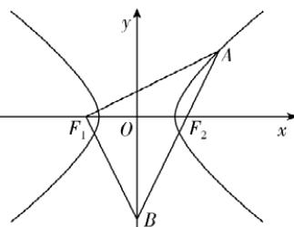

> [!faq]- 答案与解析
>
> > [!success]- **【答案】** 详见解析
>
> > [!note]- **【解析】**
> > $\frac{3\sqrt{5}}{5}$
> >
> > 思路导引 思路一:设点 $F_{1}, F_{2}, B$ 的坐标→根据 $\overrightarrow{F_{2}A} = -\frac{2}{3}\overrightarrow{F_{2}B}$ 得点 A 的坐标→根据 $\overrightarrow{F_{1}A} \perp \overrightarrow{F_{1}B}$ 得 $\overrightarrow{F_{1}A} \cdot \overrightarrow{F_{1}B} = 0$ →将点 A 的坐标代入 C 的方程→得到关于 a 和 c 的等式→求出离心率
> >
> > 思路二: 根据 $\overrightarrow{F_{2}A} = -\frac{2}{3}\overrightarrow{F_{2}B}$ 设 $|F_{2}A| = 2x$ ，则 $|F_{2}B| = 3x$ →根据双曲线的定义及几何性质表示出 $|F_{1}B|, |AF_{1}|$ →设 $\angle F_{1}AF_{2} = \theta$ ，利用 $\cos \theta = \frac{4}{5}$ 求出 $x$ →利用余弦定理求得 a 与 c 的关系→求出离心率
> >
> > 【解析】建立如图所示的坐标系，依题意可以设 $F_{1}(-c, 0), F_{2}(c, 0), B(0, n)$ .
> >
> > 
> >
> > 由 $\overrightarrow{F_2A} = -\frac{2}{3}\overrightarrow{F_2B}$ ，得 $A\left(\frac{5}{3} c, - \frac{2}{3} n\right)$ 又 $\overrightarrow{F_1A}\perp \overrightarrow{F_1B}$ ，且 $\overrightarrow{F_1A} =$ $\left(\frac{8}{3} c, - \frac{2}{3} n\right),\overrightarrow{F_1B} = (c,n)$ ，则 $\overrightarrow{F_1A}\cdot$ $\overrightarrow{F_1B} = \left(\frac{8}{3} c, - \frac{2}{3} n\right)\cdot (c,n) = \frac{8}{3} c^2-$ $\frac{2}{3} n^2 = 0$ ，所以 $n^2 = 4c^2$ 又点 $A$ 在双曲线 $C$ 上，则 $\frac{\frac{25}{9}c^2}{a^2} -\frac{\frac{4}{9}n^2}{b^2} =$ 1，整理得 $\frac{25c^2}{a^2} -\frac{4n^2}{b^2} = 9$ ，将 $n^2 = 4c^2$ $b^{2} = c^{2} - a^{2}$ 代入，得 $\frac{25c^2}{a^2} -\frac{16c^2}{c^2 - a^2} = 9$ ，即 $25e^{2} - \frac{16e^{2}}{e^{2} - 1} = 9$ ，解得 $e^2 = \frac{9}{5}$ 或 $e^2 = \frac{1}{5}$ （舍去），故 $e = \frac{3\sqrt{5}}{5}$ 多种解法由 $\overrightarrow{F_2A} = -\frac{2}{3}\overrightarrow{F_2B}$ 得 $\frac{|F_2A|}{|F_2B|} = \frac{2}{3}$ 设 $|F_{2}A| = 2x$ ，则 $|F_{2}B| =$ $3x,|AB| = 5x.$ 由双曲线的对称性可得 $|F_1B| = 3x,$ 由双曲线的定义可得 $|AF_{1}| = 2x + 2a.$ 设 $\angle F_{1}AF_{2} = \theta ,$ 则 $\sin \theta = \frac{3x}{5x} = \frac{3}{5},$ 所以 $\cos \theta = \frac{4}{5} =$ $\frac{2x + 2a}{5x}$ 解得 $x = a$ 所以 $|AF_1| = 4a,|AF_2| = 2a.$ 在 $\triangle AF_1F_2$ 中，由余弦定理可得 $\cos \theta = \frac{16a^2 + 4a^2 - 4c^2}{16a^2} = \frac{4}{5},$ 即 $5c^{2} =$ $9a^{2}$ ，可得 $e = \frac{3\sqrt{5}}{5}.$
