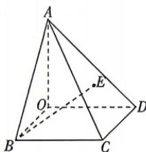

## 专练1 新定义、新情境专练

错题本

## 刷素养

## 题型1 空间向量与立体几何中的新定义、新情境问题

1.《九章算术》是我国一部数学经典著作,其在卷第五《商功》中描述的几何体“阳马”实为底面为矩形,一侧棱垂直于底面的四棱锥.如图,在“阳马”

A-OBCD中，E为△ACD的重心，若 $\overrightarrow{AB} = a$ ， $\overrightarrow{AC} = b, \overrightarrow{AD} = c$ ，则 $\overrightarrow{BE} =$ （）A. $-a + \frac{1}{2} b + \frac{1}{2} c$ B. $-a + \frac{1}{3} b + \frac{1}{3} c$ C. $a + \frac{2}{3} b + \frac{2}{3} c$ D. $-a + \frac{1}{3} b - \frac{1}{3} c$

![[高中/课堂同步/教辅/必刷题/2027版 必刷题 数学选择性必修第一册RJA/01_第一章/专练1_新定义_新情境专练/questions/Q00072508.md]]
![[高中/课堂同步/教辅/必刷题/2027版 必刷题 数学选择性必修第一册RJA/01_第一章/专练1_新定义_新情境专练/questions/Q00072509.md]]
![[高中/课堂同步/教辅/必刷题/2027版 必刷题 数学选择性必修第一册RJA/01_第一章/专练1_新定义_新情境专练/questions/Q00072510.md]]
![[高中/课堂同步/教辅/必刷题/2027版 必刷题 数学选择性必修第一册RJA/01_第一章/专练1_新定义_新情境专练/questions/Q00072511.md]]
![[高中/课堂同步/教辅/必刷题/2027版 必刷题 数学选择性必修第一册RJA/01_第一章/专练1_新定义_新情境专练/questions/Q00072512.md]]
![[高中/课堂同步/教辅/必刷题/2027版 必刷题 数学选择性必修第一册RJA/01_第一章/专练1_新定义_新情境专练/questions/Q00072513.md]]
![[高中/课堂同步/教辅/必刷题/2027版 必刷题 数学选择性必修第一册RJA/01_第一章/专练1_新定义_新情境专练/questions/Q00072514.md]]
![[高中/课堂同步/教辅/必刷题/2027版 必刷题 数学选择性必修第一册RJA/01_第一章/专练1_新定义_新情境专练/questions/Q00072515.md]]
![[高中/课堂同步/教辅/必刷题/2027版 必刷题 数学选择性必修第一册RJA/01_第一章/专练1_新定义_新情境专练/questions/Q00072516.md]]
![[高中/课堂同步/教辅/必刷题/2027版 必刷题 数学选择性必修第一册RJA/01_第一章/专练1_新定义_新情境专练/questions/Q00072517.md]]
