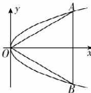

> [!faq]- 答案与解析
>
> > [!success]- **【答案】** D
>
> > [!note]- **【解析】**
> > D 【解析】设等边三角形的另外两个顶点分别为 A, B，由抛物线的对称性可知 A, B 关于 x 轴对称，不妨设点 A 在第
> >
> > 
> >
> > 一象限，设点 A 的坐标为 $(x_{0}, y_{0})$ $(x_{0} > 0, y_{0} > 0)$ ，则点 B 的坐标为 $(x_{0}, -y_{0})$ ，则 $|AB| = 2y_{0}$ ， $|OA| = \sqrt{x_{0}^{2} + y_{0}^{2}}$ 。因为 $\triangle ABC$ 是等边三角形，故 $2y_{0} = \sqrt{x_{0}^{2} + y_{0}^{2}}$ ，等式两边平方后化简得 $3y_{0}^{2} = x_{0}^{2}$ ，因为点 A 在抛物线上，故 $y_{0}^{2} = 4x_{0}$ ，代入后解得 $x_{0} = 12$ 或 $x_{0} = 0$ （舍去），故点 A 的坐标为 $(12, 4\sqrt{3})$ ，所以等边三角形的边长为 $2y_{0} = 8\sqrt{3}$ ，
> >
> > 故选 **D**.
