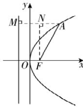

> [!faq]- 答案与解析
>
> > [!success]- **【答案】** A
>
> > [!note]- **【解析】**
> > A 【解析】过点 A 作 AM 垂直抛物线的准线, 垂足为 M, 过点 F 作 $FN \perp AM$ 于点 N, 由于 $|AF| = 2$ , $\angle OFA = 120^{\circ}$ , 则 $\angle NFA = 30^{\circ}$ , 故 $|AN| = 1$ . 又 $|AM| = |AF| = 2$ , 则 $|MN| = 2 |OF| = p = |AM| - |AN| = 1$ , 故 p = 1. 故选 A.
> >
> > 
