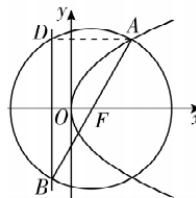

> [!faq]- 答案与解析
>
> > [!success]- **【答案】** B
>
> > [!note]- **【解析】**
> > B 【解析】连接 AD, 因为 A, F, B 三点共线, 所以 AB 为圆 F 的直径, 则 $AD \perp BD$ .
> >
> > 
> >
> > $|AD|=|AF|=\frac{1}{2}|AB|$ ，所以 $\angle ABD=30^{\circ}$ 。因为F到准线的距离为6，所以 $|AF|=|BF|=2\times6=12$ 。
> >
> > 故选 **B**.
