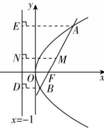

> [!faq]- 答案与解析
>
> > [!success]- **【答案】** B
>
> > [!note]- **【解析】**
> > B 【解析】如图, 抛物线 $y^{2}=4x$ 的焦点为 $F(1,0)$ , 准线为直线 x=-1, 即 $x+1=0$ .
> >
> > 
> >
> > 过点 A, B 作准线的垂线，垂足分别为 E, D，则有 $\left|AB\right| = \left|AF\right| + \left|BF\right| = \left|AE\right| + \left|BD\right| = 8$ 。过 AB 的中点 M 作准线的垂线，垂足为 N，则 MN 为直角梯形 ABDE 的中位线，则 $\left|MN\right| = \frac{1}{2} (\left|AE\right| + \left|BD\right|) = 4$ ，即点 M 到准线 $x + 1 = 0$ 的距离为 4。
> >
> > 故选 **B**.
