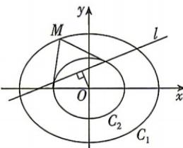

<!-- question-source:start -->
2.[江西师大附中2025高二期中]从椭圆 $C:\frac{x^{2}}{a^{2}}+\frac{y^{2}}{b^{2}}=1(a>b>0)$ 外一点

$P(x_{0},y_{0})$ 向椭圆引两条切线,切点分别为A,
B,则直线AB称作点P关于椭圆C的极线,其
方程为 $\frac{x_{0}x}{a^{2}}+\frac{y_{0}y}{b^{2}}=1$ . 现有如图所示的两个椭圆 $C_{1},C_{2}$ ,离心率分别为 $e_{1},e_{2},C_{2}$ 内含于 $C_{1}$ ,椭圆 $C_{1}$ 上的任意一点M关于 $C_{2}$ 的极线为l,若原点O到
直线l的距离为1,则 $e_{1}^{2}-e_{2}^{2}$ 的最大值为（）
A. $\frac{1}{2}$ B. $\frac{1}{3}$ C. $\frac{1}{5}$ D. $\frac{1}{4}$
<!-- question-source:end -->

![[Q00072454A1]]
