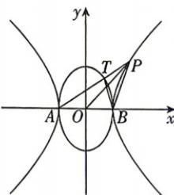

<!-- question-source:start -->
5.[辽宁大连2026高二期中]已知椭圆 $x^{2}+\frac{y^{2}}{3}=1$ 的左、右两个顶点分别为A,B.曲线C是以A,B两点为顶点,离心率为2的双曲线.设点P在第一象限且在曲线C上,直线AP与椭圆相交于另一点T.

(1) 求曲线 C 的方程;

(2) 设点 P, T 的横坐标分别为 $x_{1}, x_{2}$ ，证明： $x_{1} \cdot x_{2} = 1;$

(3)设 $\triangle TAB$ 与 $\triangle POB$ (其中 $O$ 为坐标原点)的面积分别为 $S_{1}$ 与 $S_{2}$ ,且 $\overrightarrow{PA} \cdot \overrightarrow{PB} \leqslant 12$ ,求 $S_{1}S_{2}$ 的取值范围.

视频讲解

错题本
<!-- question-source:end -->

![[Q00072457A1]]
