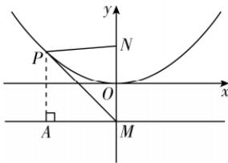

> [!faq]- 答案与解析
>
> > [!success]- **【答案】** D
>
> > [!note]- **【解析】**
> > D 【解析】易知 $N(0,2)$ , $M(0,-2)$ ，如图，过 P 作 PA 垂直于准线，垂足为点 A，
> >
> > 
> >
> > 由抛物线定义知 $|PA|=|PN|$ ，则 $\frac{|PM|}{|PN|}=m=\frac{|PM|}{|PA|}=\frac{1}{\sin\angle PMA}$ .
> > 易知当直线 PM 与抛物线相切时 $\angle PMA$ 最小, 此时 m 取得最大值.
> > 不妨设 $l_{PM}: y = kx - 2$ ，与抛物线方程联立得 $x^{2} - 8kx + 16 = 0$ ，则 $\Delta = (-8k)^{2} - 16 \times 4 = 0$ ，解得 $k = \pm 1$ ，
> > 此时可知 $\angle PMA = 45^{\circ}$ ，则 $m = \frac{1}{\sin\angle PMA} = \sqrt{2}$ .
> >
> > 故选 **D**.
