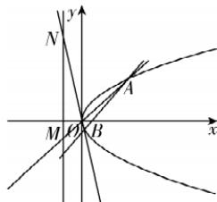

> [!faq]- 答案与解析
>
> > [!success]- **【答案】** B
>
> > [!note]- **【解析】**
> > B 【解析】由题意知抛物线 $y^{2}=2px(p>0)$ 上任意一点到焦点 F 的距离与它到直线 x=-1 的距离相等，因此 $-\frac{p}{2}=-1, p=2$ ，抛物线的方程为 $y^{2}=4x$ 。设直线 AB 的方程为 $y=k(x-1)$ ，且
> >
> > $M(-2,y_{M}),N(-2,y_{N}),A(x_{1},y_{1}),$ $B(x_{2},y_{2})$ ，由 $\left\{\begin{aligned}y=k(x-1),\\ y^{2}=4x\end{aligned}\right.$ 得 $k^{2}x^{2}-$ $(4+2k^{2})x+k^{2}=0,$ 所以 $\Delta=(4+2k^{2})^{2}-4k^{2}\times k^{2}=16k^{2}+16>0, k\neq0,$ 则 $x_{1}x_{2}=1$ ，所以 $\frac{S_{\triangle ABO}}{S_{\triangle MNO}}=\frac{\frac{1}{2}|AO|\cdot|BO|\cdot\sin\angle AOB}{\frac{1}{2}|MO|\cdot|NO|\cdot\sin\angle MON}=$ $\frac{|AO|\cdot|BO|}{|MO|\cdot|NO|}=\frac{x_{1}}{2}\cdot\frac{x_{2}}{2}=\frac{1}{4}.$ 故选 B.
> > → 点悟：设直线 AO, BO 与 x 轴正半轴所成的角分别为 $\theta_{1}, \theta_{2}$ ，则 $\frac{|AO|\cdot|BO|}{|MO|\cdot|NO|}=\frac{|x_{1}|}{|\cos\theta_{1}|}\cdot\frac{|x_{2}|}{|\cos\theta_{2}|}=\frac{x_{1}}{2}\cdot\frac{x_{2}}{2}$
> >
> > 
