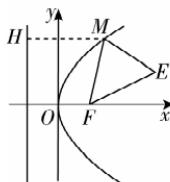

> [!faq]- 答案与解析
>
> > [!success]- **【答案】** BD
>
> > [!note]- **【解析】**
> > BD 【解析】由抛物线 $C: y^{2} = 4x$ ，可得焦点 $F(1,0)$ ，准线方程为 x = -1，故 A
> >
> > 错误. 如图所示, 过点 M 作 $MH \perp$ 准线于点 A, 则 $|MF| = |MH|$ , 故 $|ME| + |MF| = |ME| + |MH|$ , 当且仅当 E,
> >
> > 
> >
> > M,H 三点共线时, $|ME|+|MF|$ 取到最小值,最小值为点 E 到准线的距离,为 4,故 B 正确.
> > 由题意知,抛物线 $y^{2}=4x$ 的焦点坐标为(1,0),当直线 AB 的斜率存在时,设直线 AB 的方程为 $y=k(x-1)$ ,由 $\left\{\begin{aligned}y^{2}&=4x,\\ y&=k(x-1)\end{aligned}\right.$ 得 $k^{2}x^{2}-(2k^{2}+4)x+k^{2}=0,\Delta>0.$ 设点 $A(x_{1},y_{1})$ , $B(x_{2},y_{2})$ , 则 $x_{1}+x_{2}=\frac{2k^{2}+4}{k^{2}}$ , $x_{1}x_{2}=1$ . 依据抛物线的定义得, $|AF|\cdot|BF|=(x_{1}+1)(x_{2}+1)=x_{1}x_{2}+x_{1}+x_{2}+1,$ ∴ $|AF|\cdot|BF|=\frac{2k^{2}+4}{k^{2}}+2=4+\frac{4}{k^{2}}>4.$ 当直线 AB 的斜率不存在时, $|AF|\cdot|BF|=2\times2=4$ , 则 $|AF|\cdot|BF|$ 的最小
> > 造坑: 不要忘记讨论直线斜率不存在的情况
> > 值是 4, 故 C 错误.
> > 由 $M\left(\frac{y_{M}^{2}}{4},y_{M}\right)$ , 得 MF 的中点坐标为$\left(\frac{4+y_{M}^{2}}{8},\frac{y_{M}}{2}\right)$ ，而 $|MF|=\frac{y_{M}^{2}}{4}+1$ ，故 $\frac{|MF|}{2}=$ $\frac{4+y_{M}^{2}}{8}$ ，所以以线段 MF 为直径的圆与 y 轴相切，故 D 正确.
> >
> > 故选 **BD**.
